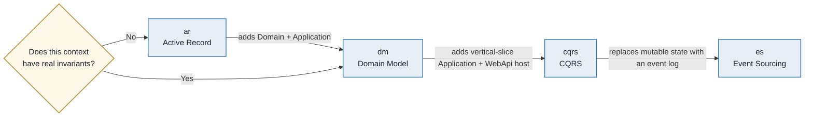
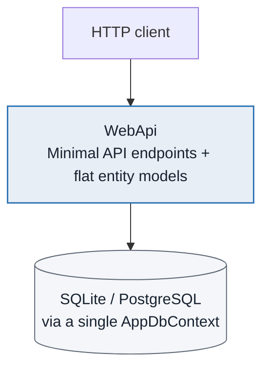
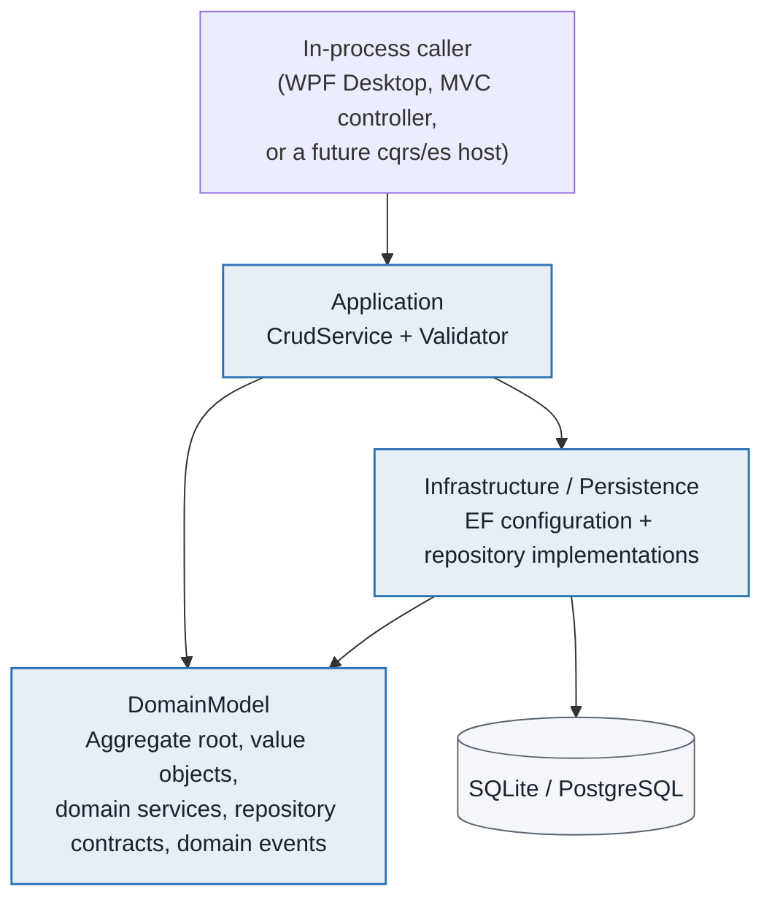
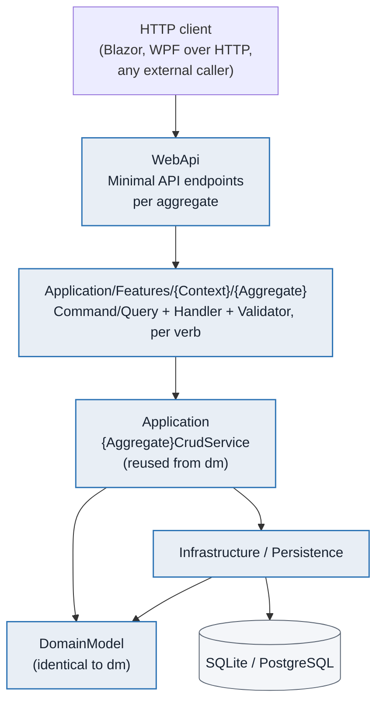
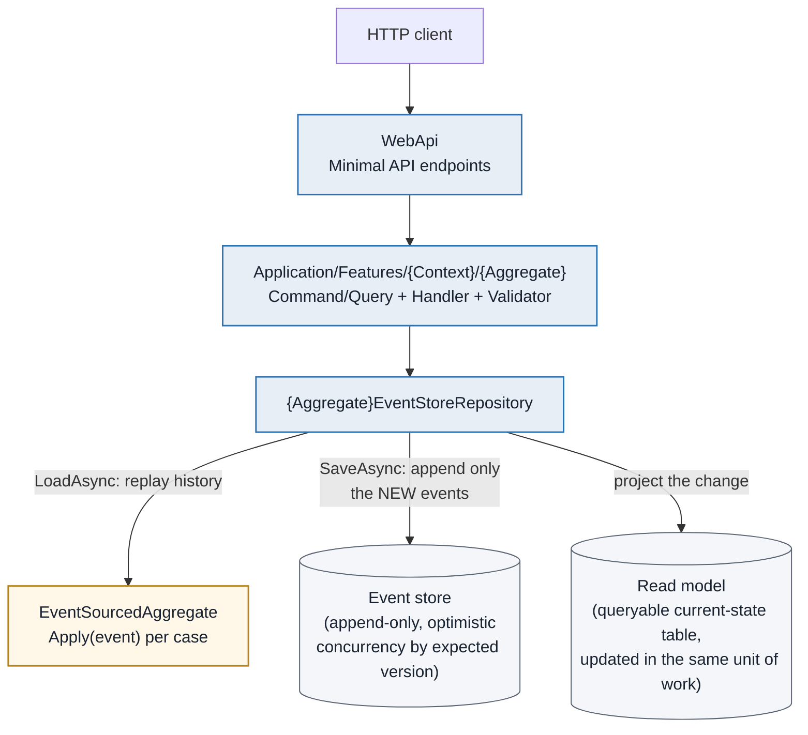
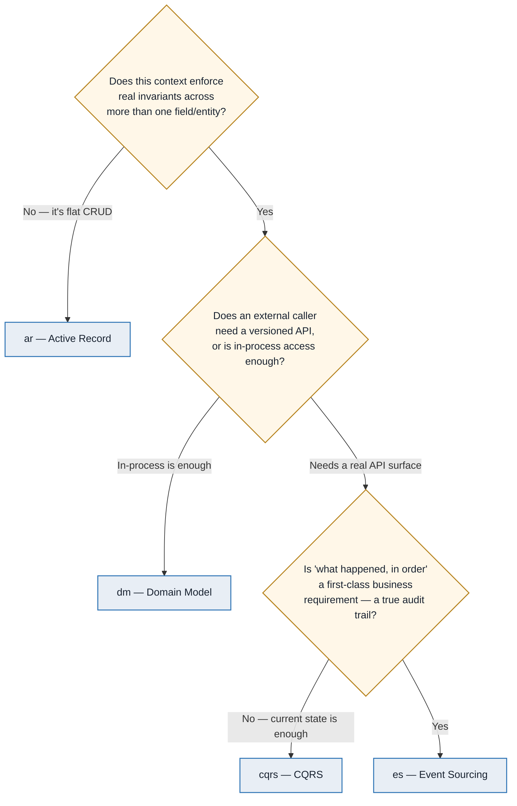
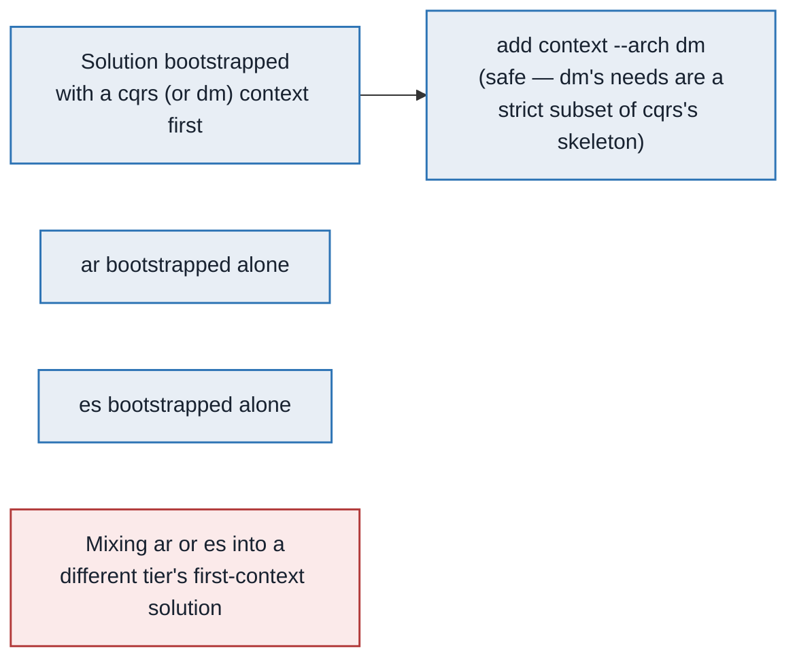
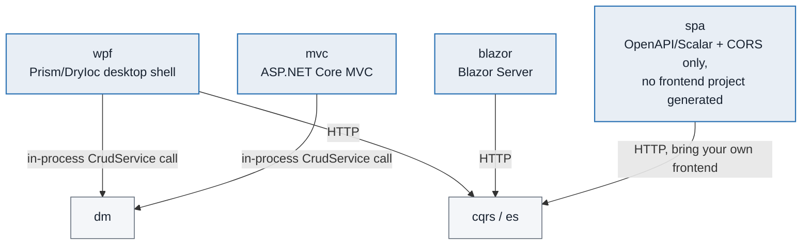

ARCHITECTURE GUIDE

# aspgen Architecture Patterns — A Guide for Architects

Four architecture patterns, one generator: what each layer does, how the patterns relate, when to choose each one, and how they combine inside a single solution.

**Document:** Architecture Patterns Guide · **Audience:** Solution architects and tech leads evaluating or governing aspgen-based solutions · **Status:** v1.0, 2026-08-06 · **Theme:** [aspgen Document Theme](aspgen-document-theme.md)

> **Decision in one paragraph.** aspgen does not generate "one architecture" — it generates from an **ordinal ladder of four patterns** (`ar` → `dm` → `cqrs` → `es`), each a strict superset of the one before it, so every bounded context in a solution can be modeled at the tier its own complexity actually earns instead of a single ceremony level imposed on the whole system. A public read-heavy catalog does not need event sourcing; a financial ledger should not be modeled as flat CRUD. This guide gives architects the layer diagrams, dependency rules, and decision criteria to assign the right pattern per context, know which patterns can share one solution, and defend that choice in review.

---

## Contents

1. Why four patterns, not one architecture
2. The pattern ladder
3. Pattern 1 — Active Record (`ar`)
4. Pattern 2 — Domain Model (`dm`)
5. Pattern 3 — CQRS (`cqrs`)
6. Pattern 4 — Event Sourcing (`es`)
7. Choosing a pattern per bounded context
8. Combining patterns in one solution
9. The UI layer: how presentation attaches to each pattern
10. Anti-patterns and common mistakes
11. Architect's decision checklist
12. Further reading

---

## 1. Why four patterns, not one architecture

Most code generators pick one architecture and apply it uniformly to every entity in a system, regardless of whether that entity is a lookup table or the core of the business domain. That trade-off looks efficient at generation time and expensive at maintenance time: simple read models drown in ceremony (repositories, handlers, validators, event streams) they will never need, while the one aggregate that actually enforces business invariants is stuck fighting the same flat CRUD shape as everything else.

aspgen's **context/arch engine** takes the opposite position: every **bounded context** — Catalog, Inventory, Sales, Billing, whatever your domain calls its own sub-systems — picks its **own** architecture tier, independent of every other context in the solution. The tiers form a deliberate ladder, not four unrelated options: each is a strict superset of the concepts in the tier below it, so moving a context up the ladder is additive (new layers, new ceremony) rather than a rewrite.

The rest of this guide walks the ladder one rung at a time — what each tier's layers actually are, what dependency direction they enforce, and the concrete signal that tells an architect "this context belongs here."

---

## 2. The pattern ladder

| Tier | Architectural pattern | Adds on top of the previous tier | Host project |
|---|---|---|---|
| `ar` | Active Record | — (baseline) | WebApi (Minimal API) |
| `dm` | Domain Model / DDD building blocks | Aggregate root, value objects, domain services, repository (contract + EF implementation), domain events, synchronous Application-layer CRUD service | *(none — class libraries only, until a UI attaches)* |
| `cqrs` | Command Query Responsibility Segregation | Vertical-slice Application layer: one Command/Query, Handler, and FluentValidation validator per verb | WebApi (Minimal API) |
| `es` | Event Sourcing | Append-only event store, event-sourced aggregates rehydrated by replaying history, synchronous read-model projections | WebApi (Minimal API) |

Two properties of this ladder matter for architectural review:

- **It is ordinal, not a menu.** `cqrs` is not an alternative to `dm` — it *is* `dm`, plus a vertical-slice Application layer and a host. `es` is not an alternative to `cqrs` — it *is* `cqrs`'s shape, with the aggregate's persistence mechanism replaced by an event log. Choosing a tier is choosing "how far up the ladder does this context's complexity justify climbing," not picking between four unrelated styles.
- **Complexity is monotonic, not the enemy.** Every rung adds ceremony (more files, more layers, more concepts a new engineer must learn) in exchange for a specific capability (testable domain invariants, an explicit read/write API split, a full audit trail). The architectural job is matching the rung to the capability the context actually needs — not defaulting everything to the top of the ladder "to be safe," which is the single most common misuse this guide will call out in Section 10.

---

## 3. Pattern 1 — Active Record (`ar`)

**What it is:** the entity and its persistence are the same thing. A property bag with a primary key, mapped straight to a database row, with CRUD endpoints operating directly against it. No separate Domain layer, no repository abstraction, no Application layer.

| Layer | Lives at | Responsibility |
|---|---|---|
| WebApi | `src/WebApi/Models/{Context}/{Entity}.cs`, `src/WebApi/Features/{Context}/{Entity}/{Entity}Endpoints.cs` | The entity *is* the model, the model *is* the DTO, and the Minimal API endpoint talks to `AppDbContext` directly — list, paged search, get-by-id, create, update, delete. |

**Dependency direction:** none to speak of — one project, one layer. That absence is the entire point of the pattern.

**When to choose it:**

- The context is a read-heavy lookup/reference/catalog surface with few or no business rules beyond "this field is required" or "this value is within a range."
- Every operation is a straightforward CRUD verb — nothing conditionally forbidden, no multi-step invariant that spans several fields or related rows.
- The team wants the lowest possible ceremony and fastest possible delivery for this specific context, and is comfortable that any future invariant will require migrating the context up the ladder (Section 8 covers that path).

**What you deliberately give up:** invariant protection (nothing stops a caller from `PUT`-ing an entity into a nonsensical state — the model has no behavior, only properties), a testable domain layer independent of EF Core, and any vocabulary richer than "rows and columns." Accept this trade only when the context's own complexity doesn't need any of it yet.

---

## 4. Pattern 2 — Domain Model (`dm`)

**What it is:** Clean Architecture's classic four-layer graph, with a proper aggregate root protecting its own invariants instead of a property bag. No host project of its own — `dm`-tier contexts are class libraries, callable in-process by whatever UI or synchronous caller needs them, until a `cqrs`/`es` host or a UI is attached on top.

| Layer | Lives at | Responsibility |
|---|---|---|
| DomainModel | `src/{Project}.DomainModel/{Context}/` | The aggregate root (`sealed partial class : BaseEntity`, private setters, invariants enforced in the constructor and `Update`), value objects (immutable records), domain services (stateless), repository **contracts**, and domain event records. Depends on nothing else. |
| Application | `src/{Project}.Application/` | `{Aggregate}CrudService` — the synchronous entry point every `dm` aggregate gets by default (`GetAllAsync`/`CreateAsync`/`UpdateAsync`/`DeleteAsync`/`SearchAsync`), plus a FluentValidation validator. Depends only on DomainModel. |
| Infrastructure / Persistence | `src/{Project}.Infrastructure/`, `src/{Project}.Persistence/` | `IEntityTypeConfiguration<T>` per aggregate, and — once `add repository` is run — a concrete EF repository implementation that the CrudService is patched to actually call instead of hitting `DbContext` directly. Depends on Application and DomainModel. |

**Dependency direction:** strictly inward — `Infrastructure/Persistence → Application → DomainModel`, and DomainModel depends on nothing. This is the one rule every `dm`+ tier enforces without exception, and the one architects should check first in any code review: a domain type referencing `Microsoft.EntityFrameworkCore` or an Infrastructure namespace is a Clean Architecture violation, full stop.

**When to choose it:**

- The context has a real aggregate — a cluster of entities/value objects that must change together under one set of invariants (stock levels that can't go negative, an order that can't be marked shipped before payment, and so on).
- You want the domain behavior unit-testable independent of EF Core, HTTP, or any UI.
- The context doesn't yet need a rich external API surface — it's consumed in-process (by a WPF Desktop shell or an MVC controller) or is a stepping stone toward `cqrs`.

**What you get over `ar`:** invariant protection, a real ubiquitous-language vocabulary in code, and a repository seam that lets persistence be swapped or mocked in tests. **What you still don't have:** an HTTP API of its own (it's headless until a host or UI attaches) and a vertical-slice command/query split — every write still goes through one general-purpose `CrudService`.

---

## 5. Pattern 3 — CQRS (`cqrs`)

**What it is:** everything `dm` has, plus a genuine Command Query Responsibility Segregation vertical-slice Application layer and a real WebApi host. This is the first tier with its own network-facing API.

| Layer | Lives at | Responsibility |
|---|---|---|
| WebApi | `src/WebApi/Features/{Context}/{Aggregate}/{Aggregate}Endpoints.cs` | Thin Minimal API endpoints, mounted automatically via the `// aspgen:features` marker — pure HTTP-shape adapters that call a Handler and translate its `Result<T>` into a status code. |
| Application — vertical slice | `src/{Project}.Application/Features/{Context}/{Aggregate}/` | One `Create{Aggregate}Command`/`Update.../Delete.../Get{Aggregate}ById...`/`Get{Aggregate}s...`/`Search{Aggregate}s...`, each with its own record, `Handler` (`IHandler<TRequest, TResponse>`), and implicit validation. Handlers are thin — they translate into a call on the same `{Aggregate}CrudService` the `dm` tier already generates; **no second repository contract or persistence path is invented**. |
| DomainModel, Application (CrudService), Infrastructure/Persistence | identical to `dm` | `cqrs` does not replace `dm`'s layers — it sits **in front of** them. |

**Dependency direction:** unchanged from `dm` at the bottom (`Infrastructure/Persistence → Application → DomainModel`), with one new rule at the top: `WebApi → vertical-slice Application → CrudService`. A Handler must never talk to `DbContext`/Infrastructure directly — that would bypass the exact separation CQRS exists to enforce.

**When to choose it:**

- The context needs a real, versioned, externally callable API surface — not just in-process access.
- Different verbs on the same aggregate genuinely have different concerns worth separating (a `Search` query's filtering/paging logic has nothing to do with a `Create` command's validation rules) — vertical slices keep each verb's code together and independently testable, instead of one increasingly bloated service class.
- You expect this context's API to grow — more verbs, more query shapes, more handlers — and want that growth to add new files, not new branches inside an existing method.

**What you get over `dm`:** a real host, one file per verb instead of one growing service class, and `add repository` registering with the WebApi host's own DI container. **What you still don't have:** any notion of "what happened, in order" — the read model is still current-state rows, not a replayable history.

---

## 6. Pattern 4 — Event Sourcing (`es`)

**What it is:** `cqrs`'s exact vertical-slice shape, with the aggregate's persistence mechanism replaced end to end: instead of storing current-state columns, every state change is an immutable event appended to a log, and the aggregate's current state is *derived* by replaying that log.

| Layer | Lives at | Responsibility |
|---|---|---|
| DomainModel | `src/{Project}.DomainModel/{Context}/{Aggregate}.cs` | `EventSourcedAggregate` (not `BaseEntity`) — a `LoadFromHistory` static factory that replays events through an `Apply(object domainEvent)` switch, and a `DequeueUncommittedEvents()` used on save. State fields are only ever set inside `Apply`. |
| Application | `{Aggregate}EventStoreRepository` | `LoadAsync` replays the aggregate's full event history; `SaveAsync` appends only the newly raised events with an optimistic-concurrency expected-version check, then immediately projects the change into a queryable read-model table in the same unit of work. |
| WebApi / vertical-slice Application | identical shape to `cqrs` | Same Command/Query/Handler/Endpoint files — `es` does not change the API-facing shape at all, only what backs it. |

**Dependency direction:** identical to `cqrs` at the top; the one architecturally significant difference is at the bottom — there is no `IEntityTypeConfiguration<T>` mapping current state directly, because current state is never the source of truth. The event log is.

**When to choose it:**

- The context's core value proposition **is** its history — "what happened, when, and why" is a first-class requirement, not an afterthought (a financial ledger, an audit-critical workflow, anything where after-the-fact reconstruction of past state matters).
- You need true point-in-time reconstruction ("what did this invoice look like on March 3rd") that a mutable current-state table structurally cannot give you.
- The team is prepared to own the operational cost: `add repository` is rejected outright for `es`-tier aggregates (the event-store repository already fills that role — there's no second contract to generate), and event versioning/schema evolution/snapshotting are deliberately **not** generated — they are real engineering work you take on once the ledger grows.

**What you get over `cqrs`:** a true audit trail and point-in-time replay. **What it costs:** every future change to an event's shape is a schema-evolution problem, not a column migration, and reasoning about "current state" always goes through the projection layer instead of a direct query. Choose `es` because the audit trail is the requirement — not because it "sounds more rigorous" than `cqrs` (Section 10 names this failure mode explicitly).

---

## 7. Choosing a pattern per bounded context

Run this decision sequence per bounded context — not once per solution. Two contexts in the same solution routinely land on different tiers, and that is the intended outcome, not an inconsistency to resolve.

Use these as concrete tie-breakers when the diagram alone doesn't settle it:

| Signal | Points toward |
|---|---|
| "It's basically a lookup table with a few columns." | `ar` |
| "Two or three fields must always change together, or a value can never go negative/invalid." | `dm` or higher |
| "This will be called by a separate frontend team, a mobile app, or a partner integration." | `cqrs` or `es` (needs a real host) |
| "Compliance/finance needs to reconstruct exactly what happened and when." | `es` |
| "We're not sure yet." | `dm` — it is the cheapest tier that still protects invariants, and climbing to `cqrs` later is additive (Section 8), not a rewrite. |

---

## 8. Combining patterns in one solution

The ladder's superset property has one direct architectural consequence: **each solution's shared skeleton (DomainModel/Application/Infrastructure/Persistence project shapes) is rendered once, by whichever context is created first via `new`.** A later `add context --arch X` only records that context's metadata — it does not retroactively backfill skeleton files the first context's tier never needed. That makes some tier combinations safe to mix in one solution, and others not yet reliable:

| Combination | Status | Why |
|---|---|---|
| `dm` context added to a `cqrs`-first (or `dm`-first) solution | **Safe** | `dm`'s required skeleton files are a strict subset of what `cqrs` already renders at `new` time. |
| `ar` context in a solution whose first context is `dm`/`cqrs`/`es` (or vice versa) | **Not reliable** | `ar` uses a completely different, flat single-project skeleton with no separate Domain/Application/Infrastructure layers at all — there is no shared shape to slot into. |
| `es` context in a solution whose first context is `dm`/`cqrs` (or vice versa) | **Not reliable** | `es` aggregates extend `EventSourcedAggregate`, not `BaseEntity`, and need event-store plumbing (`EventStore`, `EventStoreRecord`s) that a `dm`/`cqrs`-first skeleton never renders. |

**Architectural guidance:** give `ar`-tier and `es`-tier contexts **their own solution** unless one of them is the very first (and, for `ar`, *only*) context in that solution. `dm` and `cqrs` contexts are the only pairing that reliably shares one solution today — model a multi-context system as **one solution per skeleton shape**, not one solution per bounded-context boundary, and let contexts of a compatible tier share a solution deliberately. A real worked example: a wholesale-distributor system split as `CatalogApi` (`ar`, standalone), `NorthwindOps` (`dm` Inventory + `cqrs` Sales, combined), and `BillingLedger` (`es`, standalone) — three solutions, four bounded contexts, each context at the tier its own complexity earned.

> **Callout — this is a solution-skeleton constraint, not a domain-modeling one.** Nothing about DDD or CQRS theory says `ar` and `es` can't coexist logically in one system; the constraint is specific to how aspgen currently bootstraps a solution's shared project skeleton from the first context created. Treat it as a generator limitation to plan around (separate solutions), not as architectural guidance about bounded-context design itself.

---

## 9. The UI layer: how presentation attaches to each pattern

A UI framework attaches to the **whole project**, not to one context — whichever framework you pick surfaces a screen for every already-compatible aggregate across every context in that solution, and keeps generating one automatically as new aggregates are added.

| UI | Compatible tiers | Transport | Architectural note |
|---|---|---|---|
| `wpf` | `dm`, `cqrs`, `es` | In-process (`dm`) or HTTP (`cqrs`/`es`) | The only UI that spans a `dm`+`cqrs` mixed solution, because it can address both transport styles from one shell — one navigation entry per aggregate, each wired to whichever transport its own context's tier requires. |
| `blazor` | `cqrs`, `es` | HTTP | A genuine HTTP client of the WebApi host — architecturally, treat it as an external caller like any other, not as part of the backend's own dependency graph. |
| `mvc` | `dm` only | In-process | Deliberately scoped to `dm` — `cqrs`/`es` already have a working HTTP-based UI story (`blazor`/`spa`), so `mvc` fills the specific gap of an in-process UI for the otherwise-headless `dm` tier. |
| `spa` | `cqrs`, `es` | HTTP (bring your own frontend) | Not a UI at all in the generated-code sense — it patches CORS/OpenAPI/Scalar onto an existing host so a separately built or generated frontend can call it. Choose this when the frontend is out of aspgen's scope entirely (a separate React/Vue/mobile team). |

**Architectural takeaway:** the UI choice is a **transport decision**, not a modeling decision. It never changes which pattern a context is modeled at — it only changes how a screen reaches that context's Application layer (a direct in-process call for `dm`, an HTTP round-trip for `cqrs`/`es`). Decide the UI framework after the tier, driven by who's actually consuming the screens (a desktop operations team → `wpf`; a browser-based sales portal → `blazor`; an admin back-office with no JS-heavy needs → `mvc`; someone else's frontend team → `spa`).

---

## 10. Anti-patterns and common mistakes

- **Defaulting every context to the top of the ladder "to be safe."** `es` for a simple lookup table is not more rigorous — it's unjustified ceremony, a schema-evolution burden with no audit-trail requirement to justify it, and a real cost to onboarding new engineers who now must understand event replay for a table that never needed it.
- **Modeling a context that genuinely has cross-field invariants as `ar`.** The Active Record pattern has no behavior layer — nothing stops a caller from `PUT`-ing the aggregate into an invalid state. If two contexts disagree on whether "flat CRUD" fairly describes the domain, that disagreement is the actual signal to escalate to `dm`.
- **Treating the tier ladder as a per-solution choice instead of per-context.** The whole point of the engine is that Catalog can be `ar` while Billing is `es` in the same overall system (just not, today, the same *solution* — Section 8). Don't force every context in a system onto one uniform tier because "the architecture should be consistent" — consistency of *pattern-to-complexity fit* is the actual architectural goal, not uniformity of ceremony.
- **Mixing `ar` or `es` into an already-bootstrapped `dm`/`cqrs` solution and being surprised it fails.** This is a generator-skeleton constraint (Section 8), not a design flaw to work around with more code — plan solution boundaries around it up front rather than discovering it mid-project.
- **Choosing the UI framework before the tier.** A UI choice is downstream of the architecture decision, not a substitute for it (Section 9) — picking `wpf` doesn't make a context "DDD," and picking `spa` doesn't make it "microservices."
- **Assuming `add repository`/`add entity-field`/relations work identically at every tier.** They mostly do, with two tier-specific exceptions worth remembering in review: `add repository` is rejected outright for `es` aggregates (the event-store repository already owns that role), and relationships (`nav:Entity`/`nav:Entity?`/`nav:Entity[]`) only get a bidirectional inverse navigation at `dm`+ tiers — `ar`-tier relations are one-directional by design. See the [Entity Relationships guide](aspgen-entity-relationships.md) for the full model.

---

## 11. Architect's decision checklist

Before signing off on a bounded context's tier assignment:

1. **Name the invariant, if any.** If you can't state a rule that spans more than one field/entity, you likely don't need more than `ar`.
2. **Name the consumer.** In-process only (a desktop/MVC screen you also control) points at `dm`; an external, versioned, independently evolving API surface points at `cqrs`/`es`.
3. **Name the audit requirement, explicitly, in business terms** — not "it would be nice to have history," but a named compliance/finance/support need for point-in-time reconstruction. Only that justifies `es`.
4. **Check the solution-skeleton compatibility table (Section 8)** before deciding two contexts can share one solution — verify the combination is `dm`-on-`cqrs`(-or-`dm`)-first, not `ar` or `es` mixed with a different first tier.
5. **Pick the UI framework last**, driven by who consumes the screens, using the compatibility table in Section 9 — never let the UI choice retroactively justify a tier decision.
6. **Write the tier decision down** next to the context in whatever architecture record your team keeps — Section 7's decision sequence, restated in one sentence per context, is enough: *"Billing is `es` because finance requires point-in-time invoice reconstruction for audit."*

---

## 12. Further reading

- [aspgen Enterprise Developer Guide](aspgen-enterprise-developer-guide.md) — the full command reference, generated-code walkthroughs, and a real worked multi-context system (Northwind Trading) built and run end to end.
- [aspgen Entity Relationships](aspgen-entity-relationships.md) — how `nav:Entity`/`nav:Entity?`/`nav:Entity[]` relationships map to primary keys, foreign keys, and EF Core configuration at each tier.
- [Architecture Theta](architecture-theta.md) — the earlier, legacy `--app`/`--backend` profile's Clean Architecture/DDD/Prism conventions; superseded for new work by the `--context`/`--arch` engine this guide describes, but still the reference for desktop/Prism/MVVM conventions shared across both workflows.
