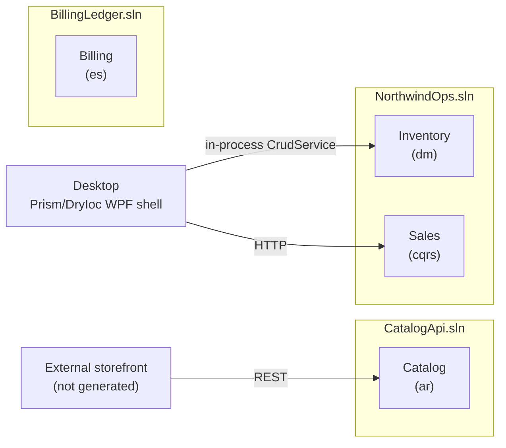

DEVELOPER GUIDE

# Building Northwind Trading on aspgen

A complete, production-oriented walkthrough of every architecture tier, UI framework, and flag aspgen supports — built around one real, multi-context enterprise solution.

**Document:** Enterprise Developer Guide · **Audience:** .NET engineers adopting aspgen · **Status:** v1.0, 2026-08-05 · **Theme:** [aspgen Document Theme](aspgen-document-theme.md)

> **Decision in one paragraph.** aspgen generates ASP.NET Core Clean Architecture APIs and Prism/DryIoc WPF apps from embedded Go `text/template` sources — nothing is downloaded at generation time and nothing runs as a service. Every project is bootstrapped through the **context/arch engine** (`--context`/`--arch`/`-ui`), which lets one solution mix independent bounded contexts at four architecture tiers (`ar`, `dm`, `cqrs`, `es`) and attach one UI framework (`wpf`, `blazor`, `mvc`, or `spa`) on top. This guide builds a real multi-context system — **Northwind Trading** — end to end, then runs every generated solution for real and tours every flag aspgen accepts.

---

## Contents

1. What you'll build
2. How aspgen thinks: `new` once, `add` incrementally
3. Install and verify aspgen
4. The architecture ladder — `ar` → `dm` → `cqrs` → `es`
5. Scaffolding the solution shell
6. Context 1 — Catalog (`ar`): a lean, headless product API
7. Context 2 — Inventory (`dm`): aggregates, value objects, domain services, repositories, events
8. Context 3 — Sales (`cqrs`): vertical-slice commands/queries and a WPF back office
9. Context 4 — Billing (`es`): event sourcing and an append-only ledger
10. A tour of every UI framework (`wpf`, `blazor`, `mvc`, `spa`)
11. Extending every layer — recipes for real feature work
12. Running everything end to end — from `new` to a working app
13. Custom templates
14. Testing, CI, and production readiness
15. Full flag reference
16. Troubleshooting and known gotchas
17. Next steps

---

## 1. What you'll build

**Northwind Trading** is a fictional wholesale distributor with four bounded contexts, each modeled at the architecture tier that actually fits its complexity — not the tier that looks the most impressive. The contexts split across **three separate solutions**, because aspgen currently scaffolds each solution's shared Domain/Application/Infrastructure skeleton from whichever context is created first, and that skeleton isn't interchangeable across every tier (see the callout in Section 4 and the Troubleshooting section):

| Context | Business need | Tier | Solution | Why this shape |
|---|---|---|---|---|
| **Catalog** | Public product lookup, high read volume, few business rules | `ar` | `CatalogApi` (standalone) | Flat CRUD is the right amount of ceremony for "here is a product record," and `ar`'s lean single-project skeleton can't host `dm`/`cqrs`/`es` contexts alongside it. |
| **Inventory** | Stock levels, reservations, warehouse transfers — invariants matter | `dm` | `NorthwindOps` (combined) | Needs an aggregate root protecting invariants; its needs are a subset of `cqrs`'s skeleton, so it shares a solution with Sales. |
| **Sales** | Order capture, pricing, fulfillment — multiple verbs, a real API surface | `cqrs` | `NorthwindOps` (combined) | Vertical-slice commands/queries plus a WebApi host — bootstraps the shared skeleton Inventory then reuses. |
| **Billing** | Invoices and ledger entries — full auditability, "what happened and when" | `es` | `BillingLedger` (standalone) | Event sourcing gives a true audit trail, but `es`'s event-sourced base class isn't compatible with `dm`/`cqrs`'s `BaseEntity` skeleton, so it gets its own solution. |



`NorthwindOps` attaches one `wpf` UI spanning its two contexts, giving warehouse and sales staff a single Prism/DryIoc desktop shell with a module per context — `wpf` is the UI framework most tolerant of mixed tiers within one project (it works against `dm`, `cqrs`, or `es` individually, and against a `dm`+`cqrs` combination specifically, since `cqrs`'s skeleton is a superset of what `dm` needs). `CatalogApi` stays headless: `ar`-tier contexts get a real Minimal API host but no aspgen-generated UI screens today, which is the correct trade-off for a lean, high-traffic read API meant to be called directly (curl, Postman, a separate storefront app, or a hand-written SPA). `BillingLedger` stands alone as its own deployable service, given its own UI in Section 10.

Section 10 then tours all four UI frameworks (`wpf`, `blazor`, `mvc`, `spa`), each attached to whichever project actually supports it, since a single project only gets one attached UI.

## 2. How aspgen thinks: `new` once, `add` incrementally

aspgen is a two-step generator, always:

1. **`new`** initializes a project once — tree, `.sln`, and `.aspgen/manifest.json`. It always requires `--context NAME --arch ar|dm|cqrs|es`.
2. **`add`** (and `import-db`) mutate that already-generated project incrementally. `add` never creates a missing project; if `--project` is omitted it searches the current directory and its parents for `.aspgen/manifest.json`.

Everything is rendered from Go `text/template` sources embedded in the `aspgen` binary (`internal/templates/files/**`) — export and inspect them any time with `aspgen templates export`.

Each bounded context picks its own architecture tier independently, so one solution can mix e.g. a simple `ar` context alongside an event-sourced `es` context — that's what Section 4 covers, and exactly how Northwind Trading is built below.

> **Callout — flag forms.** Every aspgen flag accepts three equivalent forms: `--flag value`, `--flag:value`, and `-flag:value`. This guide uses the space form throughout; use whichever reads best in your own scripts.

---

## 3. Install and verify aspgen

```powershell
git clone <this-repo>
cd aspgen
go build ./cmd/... ./internal/...
go run ./cmd/aspgen version
go run ./cmd/aspgen --help
```

`go run ./cmd/aspgen` is used for every command in this guide; substitute a built `aspgen.exe` if you prefer. aspgen never shells out to `dotnet` itself — you build and test the generated solution with your normal .NET tooling.

---

## 4. The architecture ladder — `ar` → `dm` → `cqrs` → `es`

The four tiers are an ordinal ladder: each is a strict superset of the concepts in the tier before it.

| Tier | Adds on top of the previous tier | Host project | `add` kinds available |
|---|---|---|---|
| `ar` | Flat entity, direct `DbContext` CRUD | WebApi (Minimal API) | `add entity` |
| `dm` | Aggregate root, value objects, domain services, repository (interface + EF impl), event record scaffolds, synchronous `CrudService` | *(none — class libraries only)* | `add aggregate`, `add value-object`, `add domain-service`, `add repository`, `add event` |
| `cqrs` | Vertical-slice Application layer: Command/Query + Handler + FluentValidation validator per verb | WebApi (Minimal API) | all of `dm`'s kinds, `add repository` registers with DI |
| `es` | Append-only event store, event-sourced aggregates (`Raise`/`ApplyHistoric`/`LoadFromHistory`), synchronous read-model projections | WebApi (Minimal API) | all of `dm`'s kinds except `add repository` (already generated) |

```text
ar    Active Record: flat entity, direct DbContext CRUD.
dm    Domain Model: aggregate root + value objects + domain services + repository + events,
      synchronous Application-layer CRUD service. No host project (class libraries only).
cqrs  dm's Domain layer + vertical-slice Application (Command/Query/Handler/Validator per
      verb) + a WebApi Minimal API host.
es    cqrs tier + an append-only event store, event-sourced aggregates (rehydrated by
      replaying events), and read-model projections.
```

A single solution may freely mix tiers across contexts — that's the point of the engine, and exactly how Northwind Trading is built below.

---

> **Callout — mixing tiers in one solution.** Each solution's shared Domain/Application/Infrastructure/Persistence project skeleton is created once, by whichever context is created first via `new`; a later `add context --arch X` records the new context's metadata but does not backfill skeleton files the first context's tier never rendered. In practice: a `dm` context can always be added to a project whose first context is `cqrs` (or another `dm`), since `dm`'s needs are a strict subset of `cqrs`'s. `es` uses a different aggregate base (`EventSourcedAggregate`, not `BaseEntity`) and needs its own event-store plumbing, and `ar` uses an entirely different, simpler single-project skeleton with no separate Domain/Application layers at all — mixing either of those with a different first tier in the same solution isn't reliably supported yet. Give `ar`-tier and `es`-tier contexts their own solution unless they are the very first (and, for `ar`, only) context. See Troubleshooting for the exact symptoms.

## 5. Scaffolding the solution shell

Bootstrap **`NorthwindOps`** with Sales at the `cqrs` tier first — `cqrs`'s skeleton is the one that Inventory's `dm` context will reuse:

```powershell
go run ./cmd/aspgen new NorthwindOps `
  --context Sales --arch cqrs `
  --database sqlite `
  --output ./NorthwindOps
```

This single command creates `NorthwindOps.sln`, the Sales context's Domain/Application/Infrastructure/Persistence/WebApi tree at the `cqrs` tier, `tests\NorthwindOps.UnitTests`/`tests\NorthwindOps.IntegrationTests` (pass `--no-tests` to skip both), `scripts\ci.ps1`, and `.aspgen/manifest.json`.

```text
NorthwindOps/
├── NorthwindOps.sln
├── .aspgen/manifest.json
├── scripts/
│   └── ci.ps1
├── src/
│   ├── NorthwindOps.DomainModel/
│   │   └── Sales/
│   ├── NorthwindOps.Application/
│   ├── NorthwindOps.Infrastructure/
│   ├── NorthwindOps.Persistence/
│   ├── NorthwindOps.Resources/
│   └── WebApi/
│       ├── Program.cs
│       └── Features/Sales/
└── tests/
    ├── NorthwindOps.UnitTests/
    └── NorthwindOps.IntegrationTests/
```

Add Inventory as a `dm`-tier context on top of that same skeleton — this direction works because `dm` needs strictly less than `cqrs` already provides (no separate host, no vertical-slice Application layer):

```powershell
go run ./cmd/aspgen add context Inventory --arch dm --project ./NorthwindOps
```

Catalog and Billing get their own solutions instead of joining `NorthwindOps` (see the Section 4 callout for why):

```powershell
go run ./cmd/aspgen new CatalogApi --context Catalog --arch ar --database sqlite --output ./CatalogApi
go run ./cmd/aspgen new BillingLedger --context Billing --arch es --database sqlite --output ./BillingLedger
```

## 6. Context 1 — Catalog (`ar`): a lean, headless product API

Catalog holds `Product` and `Category`, with a many-to-one relation from product to category:

```powershell
go run ./cmd/aspgen add entity Category name:string --context Catalog --project ./CatalogApi
go run ./cmd/aspgen add entity Product name:string sku:string price:decimal active:bool category:Category --context Catalog --project ./CatalogApi
```

`category:Category` synthesizes a required `CategoryId` foreign key and a `Category` navigation property (`nav:Entity?` would make it optional). Property types accepted by `name:type` are `string`, `int`, `long`, `decimal`, `float`, `bool`, `date` (`DateOnly`), `datetime` (`DateTime`), and `guid`/`uuid`; append `?` for nullable (`middleName:string?`). Unknown types are a hard error, not a silent pass-through.

`ar`-tier endpoints are plain Minimal APIs against `DbContext`, including list, paged search, get-by-id, create, update, and delete:

```csharp
// src/WebApi/Features/Catalog/Product/ProductEndpoints.cs (rendered)
public static class ProductEndpoints
{
    public static void MapProductEndpoints(this WebApplication app)
    {
        var group = app.MapGroup("/api/catalog/product");
        group.MapGet("/", async (AppDbContext db, CancellationToken cancellationToken) =>
            Results.Ok(await db.Products.AsNoTracking().ToListAsync(cancellationToken)));
        group.MapGet("/search", async (string? search, decimal? priceMin, decimal? priceMax, bool? active,
            int page, int pageSize, AppDbContext db, CancellationToken cancellationToken) =>
        {
            if (page < 1) page = 1;
            if (pageSize < 1) pageSize = 25;
            var query = db.Products.AsNoTracking().AsQueryable();
            if (!string.IsNullOrWhiteSpace(search)) query = query.Where(x => x.Name.Contains(search) || x.Sku.Contains(search));
            if (priceMin.HasValue) query = query.Where(x => x.Price >= priceMin.Value);
            if (priceMax.HasValue) query = query.Where(x => x.Price <= priceMax.Value);
            if (active.HasValue) query = query.Where(x => x.Active == active.Value);
            var totalCount = await query.LongCountAsync(cancellationToken);
            var items = await query.OrderBy(x => x.Id).Skip((page - 1) * pageSize).Take(pageSize).ToListAsync(cancellationToken);
            return Results.Ok(new { items, totalCount, page, pageSize, hasMore = (long)page * pageSize < totalCount });
        });
        group.MapGet("/{id:long}", async (long id, AppDbContext db, CancellationToken cancellationToken) => /* ... */);
        group.MapPost("/", async (Product request, AppDbContext db, CancellationToken cancellationToken) => /* 201 Created */);
        group.MapPut("/{id:long}", async (long id, Product request, AppDbContext db, CancellationToken cancellationToken) => /* 204 */);
        group.MapDelete("/{id:long}", async (long id, AppDbContext db, CancellationToken cancellationToken) => /* 204 */);
    }
}
```

Because Catalog has no attached UI screens, this is a real, callable REST API today: run the WebApi host and hit `/api/catalog/product/search?search=widget&page=1&pageSize=25`, or point OpenAPI/Scalar at it (`/openapi/v1.json`, `/scalar/v1`).

Catalog gets a third module — a `Supplier` entity, one required relation away from being wired into `Product` the same way `Category` already is:

```powershell
go run ./cmd/aspgen add entity Supplier name:string contactEmail:string --context Catalog --project ./CatalogApi
```

`entity-field` (Section 11) can retrofit new **scalar** properties onto `Supplier`/`Product` later without regenerating either entity — relations, though, are only synthesized at `add entity`/`add aggregate` time (`supplier:Supplier` or `supplier:Supplier?`), not by `entity-field`.

### Seeding Catalog with real Northwind sample data

The context/arch engine has no built-in `--seed` flag, so for a demo that actually looks like a wholesale distributor, hand-add a small idempotent seeding block at the `// aspgen:seed` marker `new`/`add entity` already left in `Program.cs`, using the real classic Northwind categories and products (the same public sample dataset Microsoft has shipped in Access/SQL Server tutorials for decades):

```csharp
// src/WebApi/Program.cs — add right after "// aspgen:seed"
using (var scope = app.Services.CreateScope())
{
    var db = scope.ServiceProvider.GetRequiredService<AppDbContext>();
    db.Database.EnsureCreated();
    if (!db.Categorys.Any())
    {
        var categories = new[]
        {
            new Category { Name = "Beverages" },
            new Category { Name = "Condiments" },
            new Category { Name = "Confections" },
            new Category { Name = "Dairy Products" },
            new Category { Name = "Grains/Cereals" },
            new Category { Name = "Meat/Poultry" },
            new Category { Name = "Produce" },
            new Category { Name = "Seafood" },
        };
        db.Categorys.AddRange(categories);
        db.SaveChanges();

        db.Products.AddRange(
            new Product { Name = "Chai", Sku = "BEV-001", Price = 18.00m, Active = true, CategoryId = categories[0].Id },
            new Product { Name = "Chang", Sku = "BEV-002", Price = 19.00m, Active = true, CategoryId = categories[0].Id },
            new Product { Name = "Aniseed Syrup", Sku = "CON-001", Price = 10.00m, Active = true, CategoryId = categories[1].Id },
            new Product { Name = "Chef Anton's Cajun Seasoning", Sku = "CON-002", Price = 22.00m, Active = true, CategoryId = categories[1].Id },
            new Product { Name = "Pavlova", Sku = "SWT-001", Price = 17.45m, Active = true, CategoryId = categories[2].Id },
            new Product { Name = "Teatime Chocolate Biscuits", Sku = "SWT-002", Price = 9.20m, Active = true, CategoryId = categories[2].Id },
            new Product { Name = "Queso Cabrales", Sku = "DAI-001", Price = 21.00m, Active = true, CategoryId = categories[3].Id },
            new Product { Name = "Mozzarella di Giovanni", Sku = "DAI-002", Price = 34.80m, Active = true, CategoryId = categories[3].Id },
            new Product { Name = "Gustaf's Knackebrod", Sku = "GRN-001", Price = 21.00m, Active = true, CategoryId = categories[4].Id },
            new Product { Name = "Tunnbrod", Sku = "GRN-002", Price = 9.00m, Active = true, CategoryId = categories[4].Id },
            new Product { Name = "Mishi Kobe Niku", Sku = "MEA-001", Price = 97.00m, Active = true, CategoryId = categories[5].Id },
            new Product { Name = "Alice Mutton", Sku = "MEA-002", Price = 39.00m, Active = true, CategoryId = categories[5].Id },
            new Product { Name = "Uncle Bob's Organic Dried Pears", Sku = "PRD-001", Price = 30.00m, Active = true, CategoryId = categories[6].Id },
            new Product { Name = "Tofu", Sku = "PRD-002", Price = 23.25m, Active = true, CategoryId = categories[6].Id },
            new Product { Name = "Ikura", Sku = "SEA-001", Price = 31.00m, Active = true, CategoryId = categories[7].Id },
            new Product { Name = "Konbu", Sku = "SEA-002", Price = 6.00m, Active = true, CategoryId = categories[7].Id }
        );
        db.SaveChanges();
    }
}
```

Add `using CatalogApi.WebApi.Models.Catalog;` alongside the existing `using` block so `Category`/`Product` resolve. Verified end to end: `dotnet run` then `GET /api/catalog/product` returns all 16 products with the right category IDs and prices — e.g. `{ "name": "Chai", "sku": "BEV-001", "price": 18.0, "categoryId": 1 }`. `EnsureCreated()` is a demo convenience (no EF migrations required); switch to `dotnet ef database update` once the schema needs to evolve, since `EnsureCreated()` and migrations don't mix.

### Importing Catalog from an existing database

If Catalog already exists as a legacy database, skip hand-typed properties entirely:

```powershell
go run ./cmd/aspgen import-db --project ./CatalogApi `
  --script schema.sql --provider postgres --tables Products,Categories --context Catalog
```

`import-db` maps each selected table to one entity (best-effort singularized, PascalCased) through the same code path `add entity` uses. Primary keys and (on DDD-flavored backends) audit columns are skipped automatically; unmappable column types are skipped with a warning instead of failing the whole table. A `schema.sql` backup snapshot is written at the project root every run, and **no connection string is ever persisted** to the manifest, the backup, or any generated file — `dotnet ef migrations add`/`database update` stay a manual step you run yourself.

---

## 7. Context 2 — Inventory (`dm`): aggregates, value objects, domain services, repositories, events

`dm` is where the DDD building blocks appear: an aggregate root, immutable value objects, stateless domain services, an aggregate-scoped repository, and domain events — all as a synchronous, headless class-library graph (Domain ← Application ← Infrastructure/Persistence, no host until a UI attaches).

```powershell
go run ./cmd/aspgen add aggregate StockItem sku:string quantityOnHand:int reorderPoint:int --context Inventory --project ./NorthwindOps
go run ./cmd/aspgen add value-object BinLocation aisle:string shelf:string --context Inventory --project ./NorthwindOps
go run ./cmd/aspgen add domain-service ReplenishmentPolicy --context Inventory --project ./NorthwindOps
go run ./cmd/aspgen add repository StockItemRepository --aggregate StockItem --context Inventory --project ./NorthwindOps
go run ./cmd/aspgen add event StockDepletedEvent stockItemId:long quantityOnHand:int --context Inventory --project ./NorthwindOps
```

The aggregate is a partial class split across two files — state/constructor and behavior — always generated together:

```csharp
// src/NorthwindOps.DomainModel/Inventory/StockItem.cs (rendered)
public sealed partial class StockItem : BaseEntity
{
    private StockItem() { }

    public StockItem(string sku, int quantityOnHand, int reorderPoint)
    {
        Sku = DomainGuard.Required(sku, nameof(sku));
        QuantityOnHand = quantityOnHand;
        ReorderPoint = reorderPoint;
    }

    public long Id { get; private set; }
    public string Sku { get; private set; } = default!;
    public int QuantityOnHand { get; private set; }
    public int ReorderPoint { get; private set; }
    // aspgen:navigation
}
```

```csharp
// src/NorthwindOps.DomainModel/Inventory/StockItem.Methods.cs (rendered)
public sealed partial class StockItem
{
    public void Update(string sku, int quantityOnHand, int reorderPoint)
    {
        Sku = DomainGuard.Required(sku, nameof(sku));
        QuantityOnHand = quantityOnHand;
        ReorderPoint = reorderPoint;
        Mark("system");
    }

    public override bool IsValid() => true;
    public override void Normalize() { }
    public override void Import(BaseEntity entity) { /* ... */ }
    public override string ToString() => $"StockItem #{Id}";
}
```

`BaseEntity` (shared across every `dm`/`cqrs` aggregate — `es`-tier aggregates use a different base, `EventSourcedAggregate`, covered in Section 9) provides soft delete and audit timestamps: `Deleted`, `Created`/`LastUpdated` `TimeStamp` values, and `Init(author)`/`Mark(author)`/`SoftDelete()`/`SoftUndelete()`. Mutating operations return `CommandResponse` (`Success`, optional `Message`/`Extra`, `Ok()`/`Fail()`) instead of a bare `bool`.

The generated `CrudService` is the synchronous Application-layer entry point every `dm` aggregate gets by default:

```csharp
// src/NorthwindOps.Application/StockItemCrudService.cs (rendered, trimmed)
public sealed class StockItemCrudService(NorthwindOpsDatabase database, IValidator<StockItemRequest> validator)
{
    public Task<List<StockItemView>> GetAllAsync(CancellationToken cancellationToken = default) => /* ... */;
    public async Task<StockItemView> CreateAsync(StockItemRequest request, CancellationToken cancellationToken = default)
    {
        await validator.ValidateAndThrowAsync(request, cancellationToken);
        var entity = new StockItem(request.Sku, request.QuantityOnHand, request.ReorderPoint);
        entity.Init("system");
        database.Add(entity);
        await database.SaveChangesAsync(cancellationToken);
        return new StockItemView(entity.Id, entity.Sku, entity.QuantityOnHand, entity.ReorderPoint);
    }
    public async Task<CommandResponse> UpdateAsync(long id, StockItemRequest request, CancellationToken cancellationToken = default) { /* ... */ }
    public async Task<CommandResponse> DeleteAsync(long id, CancellationToken cancellationToken = default) { /* soft delete */ }
    public async Task<(StockItemView[] Items, long TotalCount)> SearchAsync(string? search, int? quantityOnHandMin, int? quantityOnHandMax,
        int? reorderPointMin, int? reorderPointMax, int page, int pageSize, CancellationToken cancellationToken = default) { /* ... */ }
}

public sealed record StockItemRequest(string Sku, int QuantityOnHand, int ReorderPoint);
public sealed record StockItemView(long Id, string Sku, int QuantityOnHand, int ReorderPoint);
```

Use `--no-crud` on `add aggregate` when a use case should be modeled with explicit domain behavior instead of starting from generated CRUD.

`add repository` generates and wires an aggregate-scoped repository contract (Domain) plus an EF implementation (Persistence), and **patches the CrudService to actually call it** rather than leaving it dead code: `CreateAsync` becomes `repository.AddAsync(entity, ct)`, `UpdateAsync` fetches via `repository.GetByIdAsync` and saves via `repository.SaveAsync`, and `DeleteAsync` collapses to a single `repository.DeleteAsync(id, ct)`. Reads (`GetAllAsync`/`SearchAsync`) deliberately keep querying the `DbContext` directly — a CQRS-style read/write split, not a shortcut.

```text
src/NorthwindOps.DomainModel/Inventory/
├── StockItem.cs
├── StockItem.Methods.cs
├── BinLocation.cs                     (value object, immutable record)
├── ReplenishmentPolicy.cs             (domain service, stateless)
├── IStockItemRepository.cs            (repository contract)
└── StockDepletedEvent.cs              (domain event, immutable)
src/NorthwindOps.Persistence/
├── StockItemConfiguration.cs          (IEntityTypeConfiguration<StockItem>)
└── Repositories/StockItemRepository.cs
src/NorthwindOps.Application/
├── StockItemCrudService.cs
└── StockItemValidator.cs
```

Inventory has no host of its own — the WPF Desktop shell (added in Section 10) will call `StockItemCrudService` **in-process**, no HTTP involved.

Inventory gets a second aggregate — `Warehouse`, the physical location `StockItem` records ultimately belong to — with its own repository, to show that `dm`-tier contexts aren't limited to one module:

```powershell
go run ./cmd/aspgen add aggregate Warehouse name:string city:string --context Inventory --project ./NorthwindOps
go run ./cmd/aspgen add repository WarehouseRepository --aggregate Warehouse --context Inventory --project ./NorthwindOps
```

This renders the exact same shape Section 7 already walked through for `StockItem` — `Warehouse.cs`/`Warehouse.Methods.cs`, `WarehouseConfiguration.cs`, `WarehouseCrudService.cs`/`WarehouseValidator.cs`, and `IWarehouseRepository`/`Repositories/WarehouseRepository.cs` — and, once the WPF UI is attached in Section 8, `Warehouse` gets its own Desktop module automatically alongside `StockItem`.

---

## 8. Context 3 — Sales (`cqrs`): vertical-slice commands/queries and a WPF back office

`cqrs` keeps every `dm` building block and adds a WebApi host plus a genuine vertical-slice Application layer: one Command/Query, Handler, Validator per verb.

```powershell
go run ./cmd/aspgen add aggregate Order number:string customer:string total:decimal placedOn:date --context Sales --project ./NorthwindOps
go run ./cmd/aspgen add repository OrderRepository --aggregate Order --context Sales --project ./NorthwindOps
```

```text
src/NorthwindOps.Application/Features/Sales/Order/
├── CreateOrderCommand.cs
├── CreateOrderHandler.cs
├── UpdateOrderCommand.cs
├── UpdateOrderHandler.cs
├── DeleteOrderCommand.cs
├── DeleteOrderHandler.cs
├── GetOrderByIdQuery.cs
├── GetOrderByIdHandler.cs
├── GetOrdersQuery.cs
├── GetOrdersHandler.cs
├── SearchOrdersQuery.cs
├── SearchOrdersHandler.cs
└── OrderPagedResponse.cs
src/WebApi/Features/Sales/Order/
└── OrderEndpoints.cs
```

Each Handler is a thin wrapper around the same `CrudService` the `dm` tier already generates — no duplicate repository contract is invented:

```csharp
// Features/Sales/Order/CreateOrderCommand.cs (rendered)
namespace NorthwindOps.Application.Features.Sales.Order;

public sealed record CreateOrderCommand(string Number, string Customer, decimal Total, DateOnly PlacedOn);
```

```csharp
// Features/Sales/Order/CreateOrderHandler.cs (rendered)
namespace NorthwindOps.Application.Features.Sales.Order;

public sealed class CreateOrderHandler(OrderCrudService service) : IHandler<CreateOrderCommand, OrderView>
{
    public async Task<Result<OrderView>> HandleAsync(CreateOrderCommand request, CancellationToken cancellationToken = default)
    {
        var view = await service.CreateAsync(new OrderRequest(request.Number, request.Customer, request.Total, request.PlacedOn), cancellationToken);
        return Result<OrderView>.Success(view);
    }
}
```

The WebApi host is a minimal `Program.cs` that mounts every feature via a marker comment kept up to date automatically:

```csharp
// src/WebApi/Program.cs (rendered)
using NorthwindOps.Application;
using NorthwindOps.Infrastructure;

var builder = WebApplication.CreateBuilder(args);
builder.Services.AddApplication();
builder.Services.AddInfrastructure(builder.Configuration);

var app = builder.Build();
app.MapHealthChecks("/health");
// aspgen:features
app.MapGet("/", () => Results.Ok(new { application = "NorthwindOps" }));
app.Run();

public partial class Program { }
```

Sales gets a second aggregate — `Customer`, the buyer behind every `Order` — with its own repository, using the same vertical-slice shape as `Order` above (`CreateCustomerCommand`/`Handler`, etc.):

```powershell
go run ./cmd/aspgen add aggregate Customer name:string email:string --context Sales --project ./NorthwindOps
go run ./cmd/aspgen add repository CustomerRepository --aggregate Customer --context Sales --project ./NorthwindOps
```

`cqrs`-tier `add repository` also registers the repository with the WebApi host's own DI container (`services.AddScoped<ICustomerRepository, CustomerRepository>()` in `NorthwindOps.Infrastructure`'s `DependencyInjection.cs`) — one more thing `dm`-tier doesn't need, since it has no host to register into yet.

With Inventory's `StockItem`/`Warehouse` and Sales' `Order`/`Customer` aggregates all in place, attach the WPF Desktop shell:

```powershell
go run ./cmd/aspgen add ui wpf --framework wpf --theme wpfui --theme-mode light --project ./NorthwindOps
```

`Order`'s generated `Store` calls the WebApi host over HTTP (Sales is `cqrs`-tier), while the `StockItem` store from Section 7 calls its `CrudService` in-process (Inventory is `dm`-tier) — both branches live in the same templated `{{.Name}}Store.cs.tmpl`, selected by the aggregate's own tier:

```csharp
// Desktop/Modules/Order/Services/OrderStore.cs (rendered, cqrs branch — HTTP)
public sealed class OrderStore(HttpClient http) : IOrderStore
{
    private const string Path = "/api/sales/order";
    public IReadOnlyList<OrderRow> GetAll() => http.GetFromJsonAsync<List<OrderRow>>(Path).GetAwaiter().GetResult() ?? [];
    public OrderRow Save(long editingId, OrderRow value)
    {
        if (editingId == 0)
        {
            var response = http.PostAsJsonAsync(Path, value).GetAwaiter().GetResult();
            response.EnsureSuccessStatusCode();
            return response.Content.ReadFromJsonAsync<OrderRow>().GetAwaiter().GetResult() ?? value;
        }
        http.PutAsJsonAsync($"{Path}/{editingId}", value).GetAwaiter().GetResult().EnsureSuccessStatusCode();
        return value with { Id = editingId };
    }
    // Delete(...), Search(...) follow the same HTTP pattern
}
```

```csharp
// Desktop/Modules/StockItem/Services/StockItemStore.cs (rendered, dm branch — in-process)
public sealed class StockItemStore(StockItemCrudService service) : IStockItemStore
{
    public IReadOnlyList<StockItemRow> GetAll() =>
        service.GetAllAsync().GetAwaiter().GetResult()
            .Select(x => new StockItemRow(x.Id, x.Sku, x.QuantityOnHand, x.ReorderPoint))
            .ToList();

    public StockItemRow Save(long editingId, StockItemRow value)
    {
        var request = new StockItemRequest(value.Sku, value.QuantityOnHand, value.ReorderPoint);
        if (editingId == 0)
        {
            var created = service.CreateAsync(request).GetAwaiter().GetResult();
            return new StockItemRow(created.Id, created.Sku, created.QuantityOnHand, created.ReorderPoint);
        }
        service.UpdateAsync(editingId, request).GetAwaiter().GetResult();
        return value with { Id = editingId };
    }
    public void Delete(long id) => service.DeleteAsync(id).GetAwaiter().GetResult();
}
```

`--theme wpfui` adds the WPF-UI Fluent theme (NuGet package, resource dictionaries, a themed `FluentWindow` shell); `--theme-mode light|dark` picks the starting palette (default `light`) — the shell also ships a runtime toggle, so this only affects the first paint.

---

## 9. Context 4 — Billing (`es`): event sourcing and an append-only ledger

`es` keeps everything `cqrs` has and rebuilds the aggregate around events instead of mutable state: an append-only event store with optimistic concurrency, an `EventSourcedAggregate` base class, and a synchronous read-model projection updated in the same unit of work as the event append.

`Billing` gets its own solution (per Section 4/5) since `es`'s event-sourced base class isn't compatible with the `cqrs`/`dm` skeleton `NorthwindOps` already has:

```powershell
go run ./cmd/aspgen add aggregate Invoice number:string customer:string amount:decimal issuedOn:date --context Billing --project ./BillingLedger
```

The aggregate replays its own history instead of storing current-state columns directly:

```csharp
// src/BillingLedger.DomainModel/Billing/Invoice.cs (rendered, trimmed)
public sealed partial class Invoice : EventSourcedAggregate
{
    private Invoice() { }

    public static Invoice LoadFromHistory(long id, IEnumerable<object> history)
    {
        var aggregate = new Invoice { Id = id };
        foreach (var domainEvent in history) aggregate.ApplyHistoric(domainEvent);
        return aggregate;
    }

    public string Number { get; private set; } = default!;
    public string Customer { get; private set; } = default!;
    public decimal Amount { get; private set; } = default!;
    public DateOnly IssuedOn { get; private set; } = default!;

    protected override void Apply(object domainEvent)
    {
        switch (domainEvent)
        {
            case InvoiceCreatedEvent created:
                Number = created.Number; Customer = created.Customer; Amount = created.Amount; IssuedOn = created.IssuedOn;
                break;
            case InvoiceUpdatedEvent updated:
                Number = updated.Number; Customer = updated.Customer; Amount = updated.Amount; IssuedOn = updated.IssuedOn;
                break;
            case InvoiceDeletedEvent:
                Deleted = true;
                break;
            // aspgen:events
            default:
                throw new DomainException($"Unhandled event {domainEvent.GetType().Name} for Invoice #{Id}.");
        }
    }
}
```

The event-store repository loads by replaying, saves by appending only the newly-raised events (optimistic concurrency via an expected-version check), and immediately projects the change into a queryable read model:

```csharp
// src/BillingLedger.Application/InvoiceEventStoreRepository.cs (rendered, trimmed)
public sealed class InvoiceEventStoreRepository(EventStore eventStore, BillingLedgerDatabase database)
{
    public async Task<Invoice?> LoadAsync(long id, CancellationToken cancellationToken = default)
    {
        var records = await eventStore.LoadAsync(nameof(Invoice), id, cancellationToken);
        return records.Count == 0 ? null : Invoice.LoadFromHistory(id, records.Select(DeserializeEvent));
    }

    public async Task SaveAsync(Invoice aggregate, CancellationToken cancellationToken = default)
    {
        var newEvents = aggregate.DequeueUncommittedEvents();
        if (newEvents.Count == 0) return;
        var expectedVersion = aggregate.Version - newEvents.Count;
        await eventStore.AppendAsync(nameof(Invoice), aggregate.Id, expectedVersion, newEvents, cancellationToken);
        await ProjectAsync(aggregate, cancellationToken);
    }

    private async Task ProjectAsync(Invoice aggregate, CancellationToken cancellationToken)
    {
        var readModel = await database.InvoiceReadModels.FirstOrDefaultAsync(x => x.Id == aggregate.Id, cancellationToken);
        // add / update / remove InvoiceReadModel to match aggregate state, then SaveChangesAsync
    }
}
```

`add repository` is rejected for `es`-tier aggregates — `{Aggregate}EventStoreRepository` already fills that role; there is no second contract to generate. Event versioning/schema evolution and snapshotting are deliberately out of scope for the generated code — plan for them yourself as the ledger grows.

```text
src/BillingLedger.DomainModel/Billing/
├── Invoice.cs
├── Invoice.Methods.cs
└── InvoiceEvents.cs                         (Created/Updated/Deleted event records)
src/BillingLedger.Application/
├── InvoiceEventStoreRepository.cs
├── InvoiceRequest.cs
└── InvoiceValidator.cs
src/BillingLedger.Application/Features/Billing/Invoice/
├── CreateInvoiceCommand.cs / Handler.cs
├── UpdateInvoiceCommand.cs / Handler.cs
├── DeleteInvoiceCommand.cs / Handler.cs
├── GetInvoiceByIdQuery.cs / Handler.cs
├── GetInvoicesQuery.cs / Handler.cs
└── SearchInvoicesQuery.cs / Handler.cs
```

Billing gets a second event-sourced aggregate — `CreditNote`, for refunds issued against an existing invoice — to confirm an `es`-tier context isn't limited to a single aggregate either:

```powershell
go run ./cmd/aspgen add aggregate CreditNote number:string customer:string amount:decimal issuedOn:date --context Billing --project ./BillingLedger
```

`CreditNote` renders its own `EventSourcedAggregate`, `CreditNoteEvents.cs`, `CreditNoteEventStoreRepository`, and vertical-slice Command/Query/Handler set, completely independent of `Invoice`'s — every `es`-tier aggregate gets its own append-only event stream and its own read-model table.

`BillingLedger` stands alone as its own deployable service — Section 10 attaches a UI to it directly (`spa` for API-first access, or `wpf`/`blazor` if a dedicated finance-desk UI is wanted; either works since `es` is the project's only, first context).

---

## 10. A tour of every UI framework

A UI attaches to the **whole project** — one UI framework surfaces every compatible aggregate in every context, which is why `NorthwindOps` above picked a single `wpf` shell spanning its `dm` + `cqrs` contexts. This section builds one small, focused project per remaining UI framework (reusing `BillingLedger` from Section 9 for the `es` case) so each gets full coverage without overstating what one project can combine.

| UI (`-ui` / `--framework`) | Compatible tiers | Transport | Notes |
|---|---|---|---|
| `wpf` | `dm`, `cqrs`, `es` | in-process (`dm`) or HTTP (`cqrs`/`es`) | Most tolerant of mixed tiers (works with a `dm`+`cqrs` combination); supports `--theme wpfui`/`--theme-mode`. |
| `blazor` | `cqrs`, `es` | HTTP | Blazor Server calling the WebApi host. |
| `mvc` | `dm` only | in-process | Classic ASP.NET Core MVC, calls `CrudService` directly — no HTTP. |
| `spa` | `cqrs`, `es` | HTTP (bring your own frontend) | Wires OpenAPI/Scalar + permissive local-dev CORS onto the host; scaffolds no frontend project. |

Every attached UI (`wpf`/`blazor`/`mvc`) renders a full list/edit/details CRUD screen for every already-present aggregate, and keeps generating a screen automatically for every aggregate `add`ed afterward.

### `blazor` — a Sales web portal (`cqrs`)

```powershell
go run ./cmd/aspgen new SalesPortal --context Sales --arch cqrs -ui blazor --output ./SalesPortal
go run ./cmd/aspgen add aggregate Order number:string customer:string total:decimal placedOn:date --context Sales --project ./SalesPortal
```

The Blazor host calls the WebApi over HTTP, and each aggregate gets a Razor CRUD page with quick search and an advanced filter panel:

```razor
@* Components/Pages/Sales/OrderCrud.razor (rendered, trimmed) *@
@page "/sales/orders"
@inject SalesPortal.Application.OrderCrudService Service
<h1>Orders</h1>
<EditForm Model="form" OnValidSubmit="SaveAsync">
    <DataAnnotationsValidator />
    <div class="mb-3"><label>Number</label><InputText @bind-Value="form.Number" class="form-control" /></div>
    <div class="mb-3"><label>Customer</label><InputText @bind-Value="form.Customer" class="form-control" /></div>
    <div class="mb-3"><label>Total</label><InputNumber @bind-Value="form.Total" class="form-control" /></div>
    <button class="btn btn-primary" type="submit">Save</button>
</EditForm>
```

### `mvc` — a warehouse admin dashboard (`dm`)

```powershell
go run ./cmd/aspgen new WarehouseOps --context Inventory --arch dm -ui mvc --output ./WarehouseOps
go run ./cmd/aspgen add aggregate StockItem sku:string quantityOnHand:int reorderPoint:int --context Inventory --project ./WarehouseOps
```

MVC calls `CrudService` directly, in-process — no HTTP client, matching `dm`'s headless nature — with classic controller actions and query-string filters (no client-side state needed at all):

```csharp
// Controllers/StockItemController.cs (rendered, trimmed)
[Route("inventory/stock-item")]
public sealed class StockItemController(StockItemCrudService service) : Controller
{
    private const int PageSize = 25;

    [HttpGet("")]
    public async Task<IActionResult> Index(string? search, int? quantityOnHandMin, int? quantityOnHandMax, int page = 1, CancellationToken cancellationToken = default)
    {
        if (page < 1) page = 1;
        var (items, totalCount) = await service.SearchAsync(search, quantityOnHandMin, quantityOnHandMax, null, null, page, PageSize, cancellationToken);
        return View(new StockItemIndexViewModel(items, totalCount, page, PageSize, search, quantityOnHandMin, quantityOnHandMax));
    }

    [HttpPost("create")]
    public async Task<IActionResult> Create(StockItemRequest request, CancellationToken cancellationToken = default)
    {
        try { await service.CreateAsync(request, cancellationToken); return RedirectToAction(nameof(Index)); }
        catch (ValidationException ex) { foreach (var f in ex.Errors) ModelState.AddModelError(f.PropertyName, f.ErrorMessage); return View(request); }
    }
    // Details, Edit, Delete follow the same pattern
}
```

### `spa` — an API-first Billing service (`es`)

`BillingLedger` (from Section 9) already has its `Invoice` aggregate; attach `spa` to it directly instead of scaffolding a new project:

```powershell
go run ./cmd/aspgen add ui spa --framework spa --project ./BillingLedger
```

`spa` scaffolds no frontend project at all — it patches `Program.cs`/`WebApi.csproj` in place with OpenAPI discovery, Scalar (`/scalar/v1`), and a permissive local-dev CORS policy, so any hand-written or separately generated frontend (React, Vue, Angular, a mobile app) can call the API immediately during development.

Every UI in this guide can be attached either at `new` time (`-ui`) or afterward with `add ui --framework`:

```powershell
go run ./cmd/aspgen add ui spa --framework spa --project ./BillingLedger
go run ./cmd/aspgen add ui wpf --framework wpf --project ./NorthwindOps
go run ./cmd/aspgen add ui blazor --framework blazor --project ./SalesPortal
go run ./cmd/aspgen add ui mvc --framework mvc --project ./WarehouseOps
```

---

## 11. Extending every layer — recipes for real feature work

### Domain layer

- **Add a property to an existing entity/aggregate** without hand-editing every generated layer:

  ```powershell
  go run ./cmd/aspgen add entity-field StockItem binLocation:string --project ./NorthwindOps
  ```

  `entity-field` patches the already-rendered layers in place, no regeneration or duplication: for `ar`-tier entities, the flat model class and Minimal API Endpoints; for `dm`/`cqrs`/`es`-tier aggregates, the Domain class (state + behavior partials), Persistence configuration, and — for `dm`/`cqrs`-tier aggregates that have one — the Application-layer `CrudService`/Validator. It does **not** currently patch already-generated UI screens (WPF/Blazor/MVC) or hand-written seed data — update those layers yourself after adding a field. Relations are only synthesized at `add entity`/`add aggregate` time, never by `entity-field`.

- **Many-to-one relations**: `category:Category` (required) or `category:Category?` (optional) inside any `add entity`/`add aggregate` call, synthesizing the FK property and navigation.
- **Many-to-many relations**: `tags:Tag[]` synthesizes a join aggregate/entity (e.g. `ProductTag`) in the same context, with two required many-to-one relations back to both sides — no hand-written join table needed.

### Application layer

- `cqrs`/`es` Handlers are intentionally thin — put orchestration logic in the Handler, not the Endpoint; keep the Endpoint a pure HTTP-shape adapter.
- `dm`'s `CrudService` is the natural place for synchronous cross-cutting business rules that don't need the vertical-slice ceremony yet — promote to `cqrs` when the API surface earns it.

### Infrastructure / Persistence

- **Database provider**: pick it once at `new` time with `--database sqlite|postgres` (default `sqlite`); it's recorded in `.aspgen/manifest.json` and emitted into the EF Core provider registration, connection string, and DI setup. There's no incremental `add` command to switch providers on an existing project today — regenerate, or hand-edit the `Infrastructure`/`Persistence` DI registration and connection string if a provider change is unavoidable mid-project. `dm`-tier contexts are class libraries with no host yet to attach a provider to — the provider takes effect once a UI or a `cqrs`/`es` host exists.

- **Import more tables later**: `import-db` is incremental too — rerun it with a fresh `--script` and `--tables` to add more entities without touching what's already generated.

### WebApi layer

- Feature endpoints for `cqrs`/`es` register themselves via the `// aspgen:features` marker in `Program.cs` — never hand-edit that block; let `add aggregate`/`add repository` own it.
- `/health`, `/openapi/v1.json`, and `/scalar/v1` are wired on every host tier that has one (`ar`/`cqrs`/`es`).

### UI layer

- `add ui` is idempotent per framework: re-running it against a project that already has aggregates renders any screens that are still missing (e.g. after `add aggregate` added something new) without touching existing ones.

### Tests and CI

Every context/arch project gets `tests\{Project}.UnitTests` (an in-memory `DbContext` smoke test) and, for any tier with a host (`ar`/`cqrs`/`es`), `tests\{Project}.IntegrationTests` (`WebApplicationFactory<Program>` hitting the root endpoint). `scripts\ci.ps1` drives restore/build/test and optionally publish:

```powershell
.\scripts\ci.ps1              # restore, build, test
.\scripts\ci.ps1 -Publish     # ...and publish the WebApi host (skipped for headless dm-tier)
.\scripts\ci.ps1 -SkipTests -Configuration Debug
```

---

## 12. Running everything end to end — from `new` to a working app

aspgen never shells out to `dotnet` itself (Section 3), so every project this guide generated still needs a normal .NET build/run pass before it's actually "up and running." This section does that for all three Northwind Trading solutions plus the Section 10 UI-tour projects, then closes with one consolidated script covering every command in this guide, start to finish.

### CatalogApi (`ar`, headless)

```powershell
cd CatalogApi
dotnet restore
dotnet build .\CatalogApi.sln
dotnet run --project src\WebApi
```

With the host running, verify it from another terminal (defaults to `http://localhost:5000`; use the URL `dotnet run` actually printed):

```powershell
Invoke-RestMethod http://localhost:5000/health
Invoke-RestMethod http://localhost:5000/api/catalog/product
Invoke-RestMethod "http://localhost:5000/api/catalog/product/search?search=chai&page=1&pageSize=10"
```

Or open `http://localhost:5000/scalar/v1` in a browser for an interactive OpenAPI explorer. `scripts\ci.ps1` (generated alongside every project) does the restore/build/test in one call — add `-Publish` to also publish the WebApi host:

```powershell
.\scripts\ci.ps1 -Publish
```

### NorthwindOps (`dm` + `cqrs`, WebApi + WPF Desktop)

```powershell
cd ..\NorthwindOps
dotnet restore
dotnet build .\NorthwindOps.sln
dotnet run --project src\WebApi
```

In a second terminal, verify the Sales (`cqrs`) vertical-slice endpoints (Inventory is `dm`-tier and headless — it has no HTTP surface of its own, only the WPF Desktop shell calls it, in-process):

```powershell
Invoke-RestMethod http://localhost:5000/health
Invoke-RestMethod http://localhost:5000/api/sales/order
Invoke-RestMethod http://localhost:5000/api/sales/customer
```

Then, with the WebApi host still running (Sales' `Order`/`Customer` Stores call it over HTTP), launch the Desktop shell in a third terminal:

```powershell
dotnet run --project src\Desktop\NorthwindOps.Desktop.csproj
```

The Prism/DryIoc shell opens with one navigation entry per aggregate — `StockItem` and `Warehouse` (Inventory, calling `CrudService` in-process) alongside `Order` and `Customer` (Sales, calling the WebApi host over HTTP) — all in the same window, exactly as described in Section 8.

### BillingLedger (`es`, event-sourced, `spa`-ready)

```powershell
cd ..\BillingLedger
dotnet restore
dotnet build .\BillingLedger.sln
dotnet run --project src\WebApi
```

```powershell
Invoke-RestMethod http://localhost:5000/health
Invoke-RestMethod http://localhost:5000/api/billing/invoice
Invoke-RestMethod http://localhost:5000/api/billing/credit-note
```

`spa` (attached in Section 10) means `/scalar/v1` and permissive local-dev CORS are already wired — a hand-written or separately generated frontend can call this host immediately, no extra configuration required.

### The Section 10 UI-tour projects

```powershell
cd ..\SalesPortal
dotnet build .\SalesPortal.sln
dotnet run --project src\SalesPortal.AppBlazor\SalesPortal.AppBlazor.csproj
# browse to https://localhost:<port>/sales/orders

cd ..\WarehouseOps
dotnet build .\WarehouseOps.sln
dotnet run --project src\WarehouseOps.WebMvc\WarehouseOps.WebMvc.csproj
# browse to https://localhost:<port>/inventory/stock-item
```

### The full showcase: every command, creation to running

`scripts\demo-northwind-trading.ps1` (in this repo) automates everything below for you — generation plus `dotnet restore`/`build` for all five projects, with an optional `-Run` switch that launches every host/app in its own window:

```powershell
.\scripts\demo-northwind-trading.ps1 -Force -Run
```

Everything below is what that script runs, copy-pasted so you can adjust paths/output directories or run it by hand instead. This is the entire Northwind Trading system, from the very first `aspgen new` to four running apps:

```powershell
# --- Catalog (ar): a lean, headless product API ---
go run ./cmd/aspgen new CatalogApi --context Catalog --arch ar --database sqlite --output ./CatalogApi
go run ./cmd/aspgen add entity Category name:string --context Catalog --project ./CatalogApi
go run ./cmd/aspgen add entity Product name:string sku:string price:decimal active:bool category:Category --context Catalog --project ./CatalogApi
go run ./cmd/aspgen add entity Supplier name:string contactEmail:string --context Catalog --project ./CatalogApi
# (then hand-add the Section 6 seed block at // aspgen:seed in CatalogApi/src/WebApi/Program.cs)

# --- NorthwindOps (dm + cqrs): Inventory + Sales, one shared WPF shell ---
go run ./cmd/aspgen new NorthwindOps --context Sales --arch cqrs --database sqlite --output ./NorthwindOps
go run ./cmd/aspgen add context Inventory --arch dm --project ./NorthwindOps
go run ./cmd/aspgen add aggregate StockItem sku:string quantityOnHand:int reorderPoint:int --context Inventory --project ./NorthwindOps
go run ./cmd/aspgen add value-object BinLocation aisle:string shelf:string --context Inventory --project ./NorthwindOps
go run ./cmd/aspgen add domain-service ReplenishmentPolicy --context Inventory --project ./NorthwindOps
go run ./cmd/aspgen add repository StockItemRepository --aggregate StockItem --context Inventory --project ./NorthwindOps
go run ./cmd/aspgen add event StockDepletedEvent stockItemId:long quantityOnHand:int --context Inventory --project ./NorthwindOps
go run ./cmd/aspgen add aggregate Warehouse name:string city:string --context Inventory --project ./NorthwindOps
go run ./cmd/aspgen add repository WarehouseRepository --aggregate Warehouse --context Inventory --project ./NorthwindOps
go run ./cmd/aspgen add aggregate Order number:string customer:string total:decimal placedOn:date --context Sales --project ./NorthwindOps
go run ./cmd/aspgen add repository OrderRepository --aggregate Order --context Sales --project ./NorthwindOps
go run ./cmd/aspgen add aggregate Customer name:string email:string --context Sales --project ./NorthwindOps
go run ./cmd/aspgen add repository CustomerRepository --aggregate Customer --context Sales --project ./NorthwindOps
go run ./cmd/aspgen add ui wpf --framework wpf --theme wpfui --theme-mode light --project ./NorthwindOps

# --- BillingLedger (es): event sourcing and an append-only ledger ---
go run ./cmd/aspgen new BillingLedger --context Billing --arch es --database sqlite --output ./BillingLedger
go run ./cmd/aspgen add aggregate Invoice number:string customer:string amount:decimal issuedOn:date --context Billing --project ./BillingLedger
go run ./cmd/aspgen add aggregate CreditNote number:string customer:string amount:decimal issuedOn:date --context Billing --project ./BillingLedger
go run ./cmd/aspgen add ui spa --framework spa --project ./BillingLedger

# --- Section 10 UI-tour projects (blazor and mvc, each in its own solution) ---
go run ./cmd/aspgen new SalesPortal --context Sales --arch cqrs -ui blazor --output ./SalesPortal
go run ./cmd/aspgen add aggregate Order number:string customer:string total:decimal placedOn:date --context Sales --project ./SalesPortal
go run ./cmd/aspgen new WarehouseOps --context Inventory --arch dm -ui mvc --output ./WarehouseOps
go run ./cmd/aspgen add aggregate StockItem sku:string quantityOnHand:int reorderPoint:int --context Inventory --project ./WarehouseOps

# --- Build and run every solution ---
foreach ($p in "CatalogApi", "NorthwindOps", "BillingLedger", "SalesPortal", "WarehouseOps") {
    Push-Location $p
    dotnet restore
    dotnet build "$p.sln"
    Pop-Location
}

# Then, one at a time (each blocks the terminal until Ctrl+C):
dotnet run --project .\CatalogApi\src\WebApi
dotnet run --project .\NorthwindOps\src\WebApi
dotnet run --project .\NorthwindOps\src\Desktop\NorthwindOps.Desktop.csproj
dotnet run --project .\BillingLedger\src\WebApi
dotnet run --project .\SalesPortal\src\SalesPortal.AppBlazor\SalesPortal.AppBlazor.csproj
dotnet run --project .\WarehouseOps\src\WarehouseOps.WebMvc\WarehouseOps.WebMvc.csproj
```

Every `.sln` here already came with a `scripts\ci.ps1` — swap the `dotnet restore`/`build` pair above for `.\scripts\ci.ps1` (or `.\scripts\ci.ps1 -Publish`) in any of the five projects to get restore/build/test/publish in one call, matching what CI runs.

---

## 13. Custom templates

Every rendered file comes from an embedded Go `text/template` tree. Export, edit, and point aspgen at your own copy:

```powershell
go run ./cmd/aspgen templates export ./my-templates
go run ./cmd/aspgen templates list
go run ./cmd/aspgen templates validate ./my-templates
go run ./cmd/aspgen new MyApp --context Catalog --arch ar --templates ./my-templates
```

`--templates PATH` is accepted by both `new` and `add`. Validate a customized tree before pointing real generation at it — `templates validate` parses every template without rendering, catching syntax errors early.

---

## 14. Testing, CI, and production readiness

Verification checklist before shipping a change built on aspgen-generated code (or before trusting a generated project in CI):

1. `go build`/`go vet`/`go test` the generator itself if you're customizing templates (`./cmd/... ./internal/...`, never bare `./...` — example assets under `agent/skills/**` don't compile standalone).
2. `templates validate` any custom template directory.
3. `dotnet restore`/`build`/`test` the generated solution — `scripts\ci.ps1` does this in one call and mirrors what CI runs.
4. Run generation twice against the same output and confirm no unwanted duplication (idempotency is a design goal, not an afterthought).
5. Review project references match the intended dependency direction: DomainModel ← Application ← Infrastructure/Persistence ← WebApi (and Desktop → Application for `dm`-tier `-ui wpf`/`-ui mvc`).
6. Confirm `.aspgen/manifest.json` accurately reflects every context/aggregate/entity/UI — future `add` commands trust it completely.
7. For production, review `appsettings.json` connection strings yourself; aspgen never writes production secrets and never runs `dotnet ef` — migrations stay a manual, reviewed step.

---

## 15. Full flag reference

### `aspgen new`

| Flag | Values | Notes |
|---|---|---|
| `--context CTX` | any name | Required — the bounded context this project's first context belongs to. |
| `--arch TIER` | `ar`, `dm`, `cqrs`, `es` | Required. All four tiers implemented. |
| `-ui UI` | `wpf`, `blazor`, `spa`, `mvc` | See Section 10 for tier compatibility; omit for a headless project. |
| `--database DB` | `sqlite` (default), `postgres` | `dm`-tier has no host to attach the provider to yet. |
| `--theme wpfui` | flag | WPF-UI Fluent theme; requires `-ui wpf`. |
| `--theme-mode MODE` | `light` (default), `dark` | Requires `--theme wpfui`. |
| `--output PATH` | directory | Default: project name. |
| `--templates PATH` | directory | Use a custom template set instead of the embedded one. |
| `--no-tests` | flag | Skip `{Project}.UnitTests`/`{Project}.IntegrationTests`. |
| `--dry-run` | flag | Print planned changes without writing files. |
| `--force` | flag | Overwrite existing files. |

### `aspgen add` — kinds

| Kind | Usage | Notes |
|---|---|---|
| `entity` | `add entity NAME prop:type... --context CTX` | `ar`-tier context only. |
| `entity-field` | `add entity-field NAME prop:type...` | Adds scalar properties to an existing entity/aggregate, any tier; does not patch UI screens or seed data. |
| `ui` | `add ui --framework wpf\|blazor\|spa\|mvc` | Attach a UI to the project; see Section 10 for tier compatibility. |
| `context` | `add context NAME [--arch TIER]` | Declares a bounded context; `--arch` can be supplied later on a repeat call. |
| `aggregate` | `add aggregate NAME prop:type... --context CTX [--no-crud]` | `dm`+ tier context. |
| `value-object` | `add value-object NAME prop:type... --context CTX` | `dm`+ tier context. |
| `domain-service` | `add domain-service NAME --context CTX` | `dm`+ tier context. |
| `repository` | `add repository NAME --aggregate AGG --context CTX` | `dm`+ tier context (not `es`, which already has an event-store repository). |
| `event` | `add event NAME prop:type... --context CTX` | `dm`+ tier context. |

Common `add` flags: `--project PATH` (default: search up from cwd for `.aspgen/manifest.json`), `--theme wpfui`/`--theme-mode MODE` (for `ui`), `--dry-run`, `--force`.

### `aspgen import-db`

| Flag | Values | Notes |
|---|---|---|
| `--project PATH` | directory | Default: search up from cwd. |
| `--script PATH` | file | SQL DDL to parse. |
| `--provider P` | `sqlite`, `postgres`, `sqlserver`, `mysql` | Required. |
| `--tables T` | `all` (default) or comma list | |
| `--context CTX` | name | Required — the bounded context every imported table becomes an `ar`-tier entity in. |
| `--backend ddd` | flag | Override the project's own backend profile. |
| `--dry-run` / `--force` | flag | Same semantics as `new`/`add`. |

### Property type syntax

`name:type` pairs, nullable with a trailing `?` (e.g. `middleName:string?`). Accepted types: `string`, `int`, `long`, `decimal`, `float`, `bool`, `date` (→ `DateOnly`), `datetime` (→ `DateTime`), `guid`/`uuid` (→ `Guid`). Relations: `nav:Entity` (required many-to-one), `nav:Entity?` (optional many-to-one), `nav:Entity[]` (many-to-many, synthesizes a join entity/aggregate). Unknown types are always a hard error.

---

## 16. Troubleshooting and known gotchas

- **`add` fails with "no manifest found"** — you're outside the generated project tree and its parents; pass `--project PATH` explicitly.
- **`spa`/`blazor`/`mvc` UI rejected on a context** — check the tier compatibility table in Section 10; `spa`/`blazor` need `cqrs`/`es`, `mvc` needs `dm`, and `ar`-tier contexts get no generated UI screens at all by design.
- **`add repository` rejected on an `es` aggregate** — expected; the aggregate already has a generated `{Aggregate}EventStoreRepository`.
- **`--theme-mode` rejected without `--theme wpfui`** — the flag only has meaning alongside the WPF-UI Fluent theme.
- **Property type rejected** — only the type list in Section 15's property syntax table is supported; anything else is a deliberate hard error rather than a silent pass-through.
- **A generated entity is named something like `Task`** — avoid names that collide with common .NET/BCL types (`System.Threading.Tasks.Task` is the classic one); it compiles as ambiguous C#. Use a more specific domain name instead (`TodoItem`, not `Task`).
- **`go test -race` on generated Go tooling changes fails locally with "requires cgo"** — a local-machine toolchain gap, not a generator bug; CI runners have cgo enabled.
- **`add context --arch es`/`add aggregate` fails with a missing type like `EventSourcedAggregate`, or `add context --arch ar` fails with "no owning .csproj found"** — you mixed a tier into a solution whose first context can't support it (see the Section 4 callout). Bootstrap that tier's context first instead, or give it its own solution: `dm` contexts are safe to add on top of a `cqrs`-first (or `dm`-first) project; `es` and `ar` contexts should each get their own solution.
- **`dotnet restore` fails with NU1301 against a corporate NuGet feed** — restore explicitly from `nuget.org` (`dotnet restore <project> -s https://api.nuget.org/v3/index.json`), then `dotnet build` normally.

---

## 17. Next steps

- Grow Northwind Trading incrementally: `add aggregate ShipmentRoute ...` under Inventory, `add aggregate Refund ...` under Sales, or a new `Returns` context at whichever tier its complexity actually earns.
- Point `templates export` at a copy of the embedded set and adapt naming/status-code/validation conventions to your team's own standards before scaling this to a second real product.
- Wire `scripts\ci.ps1` into your existing CI pipeline (`-Publish` on merge to main, plain restore/build/test on pull requests) so every generated context stays honestly buildable, not just generatable.
