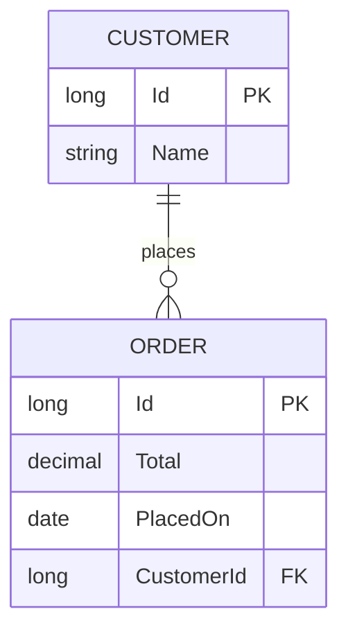
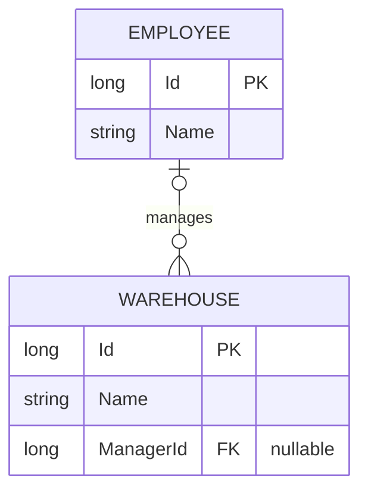
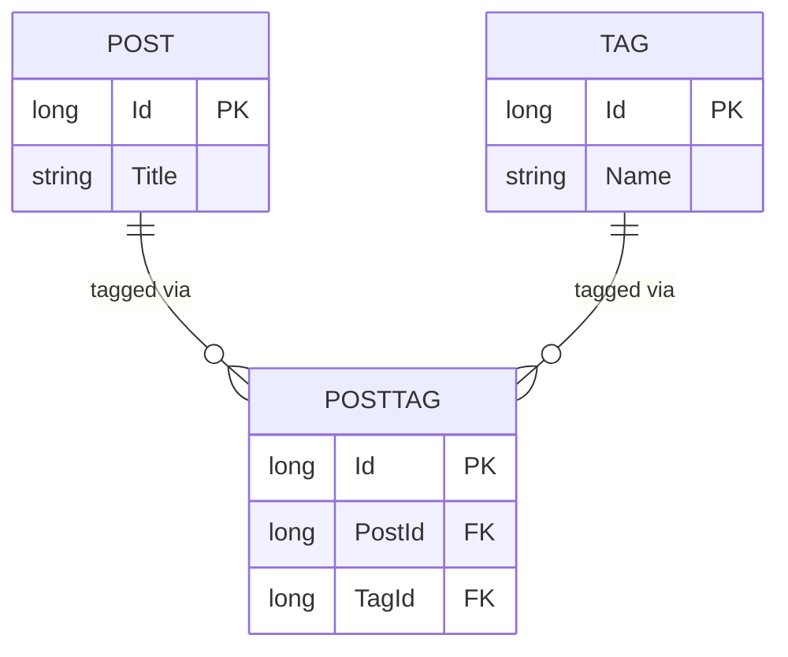
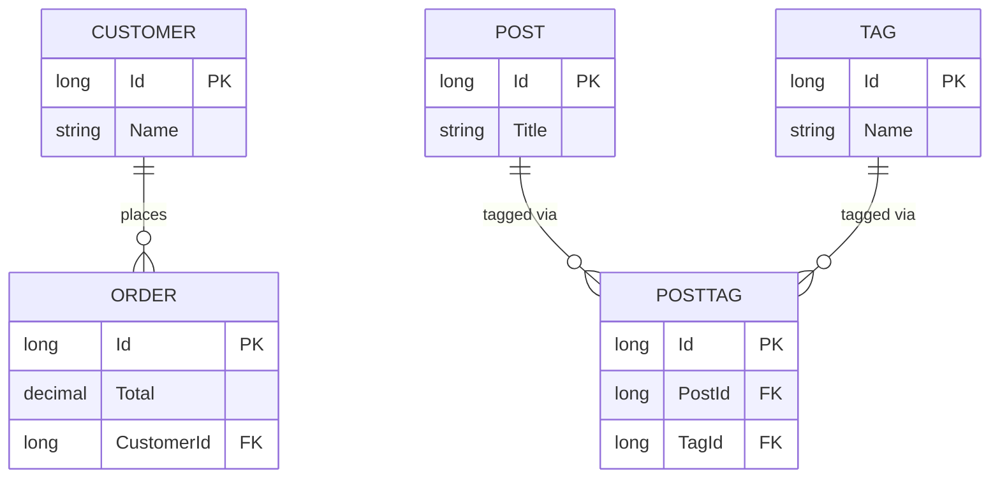

ENGINEERING REFERENCE

# aspgen Entity Relationships

How the `--context`/`--arch` engine turns `nav:Entity` arguments into primary keys, foreign keys, and EF Core navigation properties across every architecture tier.

**Document:** Entity Relationships Reference · **Audience:** .NET engineers using aspgen · **Status:** v1.0, 2026-08-06 · **Theme:** [aspgen Document Theme](aspgen-document-theme.md)

> **Decision in one paragraph.** aspgen has no `belongs_to`/`has_many` DSL — a relationship is declared once, on the "many" side, as a plain property argument shaped `name:Target`, `name:Target?`, or `name:Target[]` instead of `name:string`. From that single declaration aspgen synthesizes the foreign-key scalar property, the EF Core navigation property, the `IEntityTypeConfiguration<T>` (or, at `ar` tier, convention-based) mapping, and — for `dm`/`cqrs`/`es` aggregates — the inverse collection on the referenced side. This document is the aspgen equivalent of Rails' [Active Record Associations](https://guides.rubyonrails.org/association_basics.html) guide: it covers the three relationship forms, how primary/foreign keys are named and configured, which tiers get bidirectional navigation, and the limitations (no self-joins, no cross-context relations) worth knowing before you model a bounded context.

---

## Contents

1. Relationships overview
2. Declaring a relationship: the `nav:Target` argument
3. One-to-many (required)
4. Optional one-to-many
5. Many-to-many
6. Choosing a tier: unidirectional (`ar`) vs. bidirectional (`dm`/`cqrs`/`es`)
7. Primary keys, foreign keys, and EF configuration
8. Naming: how property names become FK and navigation names
9. Limitations: cross-context relations and self-joins
10. Worked example: Sales and Catalog
11. Relationship reference
12. Tips, tricks, and warnings

---

## 1. Relationships overview

Every aspgen entity or aggregate is declared with a flat list of `name:type` property arguments — `add entity Product name:string price:decimal --context Catalog`. A **relationship** is just a property argument whose type is another entity's name instead of a scalar type (`string`, `int`, `decimal`, and so on). aspgen recognizes the target type by looking it up in the project's manifest (`.aspgen/manifest.json`, which records every entity/aggregate already added), not by any separate `belongs_to`/`has_many` declaration.

### 1.1. Without a relationship argument

Without a relationship, two entities are simply unrelated rows:

```powershell
go run ./cmd/aspgen add entity Category name:string --context Catalog --project ./CatalogApi
go run ./cmd/aspgen add entity Product name:string price:decimal --context Catalog --project ./CatalogApi
```

Nothing connects `Product` to `Category` — there is no `CategoryId` column, no navigation property, and no way to query "products in this category" without adding your own column later.

### 1.2. With a relationship argument

Swap one scalar argument for a `name:Target` argument and aspgen wires the whole path — foreign key, navigation property, EF configuration, seed/CRUD plumbing — in one command:

```powershell
go run ./cmd/aspgen add entity Product name:string price:decimal category:Category --context Catalog --project ./CatalogApi
```

`category:Category` is the entire declaration. It synthesizes a required `CategoryId` foreign key column and a `Category` navigation property on `Product` — the same one-line trade Rails makes with `belongs_to :category` plus its migration, except aspgen renders both the column and the mapping in the same command that creates the entity.

---

## 2. Declaring a relationship: the `nav:Target` argument

Every relationship argument has the shape `name:Target`, and the `Target` must already exist in the project's manifest — added by an earlier `add entity`/`add aggregate` call, in the **same bounded context**. There are three forms:

| Form | Meaning | Cardinality |
|---|---|---|
| `name:Target` | Required many-to-one | Many `name`s to one `Target`; NOT NULL foreign key |
| `name:Target?` | Optional many-to-one | Many `name`s to zero-or-one `Target`; nullable foreign key |
| `name:Target[]` | Many-to-many | Many-to-many via a synthesized join entity |

All three are parsed by the same code path (`splitRelationArgs` in [internal/generator/relations.go](../internal/generator/relations.go)) before the remaining arguments are handed to the ordinary `name:type` property parser — so a relationship argument can appear anywhere among an entity's other properties:

```powershell
go run ./cmd/aspgen add aggregate Order total:decimal placedOn:date customer:Customer --context Sales --project ./NorthwindOps
```

---

## 3. One-to-many (required)

`customer:Customer` on `Order` says: **many orders belong to one customer**. In database terms the foreign key lives on the "many" side (`Order.CustomerId`) — exactly the placement rule Rails documents for `belongs_to`.



Generated `Order.cs` (dm-tier aggregate):

```csharp
public sealed partial class Order : BaseEntity
{
    public long Id { get; private set; }
    public decimal Total { get; private set; } = default!;
    public DateOnly PlacedOn { get; private set; } = default!;
    public long CustomerId { get; private set; }
    public Customer? Customer { get; private set; }
    // aspgen:navigation
}
```

Generated `OrderConfiguration.cs`:

```csharp
public sealed class OrderConfiguration : IEntityTypeConfiguration<Order>
{
    public void Configure(EntityTypeBuilder<Order> builder)
    {
        builder.HasKey(x => x.Id);
        builder.HasOne(x => x.Customer).WithMany().HasForeignKey(x => x.CustomerId);
    }
}
```

`dm`+ tiers also patch the referenced side: `Customer.cs` gains a read-only inverse collection between the `// aspgen:navigation` marker, so you can walk the relationship from either end:

```csharp
public sealed partial class Customer : BaseEntity
{
    // ...
    // aspgen:navigation
    public ICollection<Order> Orders { get; set; } = [];
}
```

---

## 4. Optional one-to-many

Append `?` to the target type for an optional relationship — a nullable foreign key, matching `belongs_to :author, optional: true` in Rails:

```powershell
go run ./cmd/aspgen add aggregate Warehouse name:string manager:Employee? --context Inventory --project ./NorthwindOps
```



The only difference in the generated code is the FK's C# type and the config helper used to synthesize it (`synthesizeRelationProperty` in relations.go):

```csharp
public long? ManagerId { get; private set; }
public Employee? Manager { get; private set; }
```

The `HasOne(...).WithMany().HasForeignKey(...)` line is unchanged — EF infers "optional" purely from `ManagerId` being `long?` instead of `long`, so aspgen does not need a separate `.IsRequired(false)` call.

> **Callout — no database-level referential-integrity toggle.** Unlike Rails' `belongs_to ... , foreign_key: true`, aspgen does not expose a flag to skip or add a DB-level FK constraint independently of nullability — every relationship gets `HasForeignKey`, and nullability alone controls whether the constraint accepts `NULL`.

---

## 5. Many-to-many

`name:Target[]` (a bracketed target) declares a many-to-many relationship. Rails needs a whole decision tree here — `has_and_belongs_to_many` vs. `has_many :through` — but aspgen only has one shape: it always materializes an explicit **join entity**, named by concatenating the declaring entity and the target (`Post` + `Tag` → `PostTag`), because a join entity with its own `Id`, both foreign keys, and a normal `IEntityTypeConfiguration<T>` is easier to extend later (matching Rails' own guidance to prefer `has_many :through` for anything beyond the most trivial case).

```powershell
go run ./cmd/aspgen add aggregate Tag name:string --context Catalog --project ./CatalogDm
go run ./cmd/aspgen add aggregate Post title:string tags:Tag[] --context Catalog --project ./CatalogDm
```



`tags:Tag[]` synthesizes a `PostTag` aggregate with two required many-to-one relations — one back to `Post`, one to `Tag` — reusing exactly the same rendering, EF configuration, and CRUD service as any other two-relation entity. No bespoke join-table template exists; `PostTag` is a first-class aggregate like any other, which means it also gets its own `PostTagCrudService`, its own Fluent API configuration, and (at `cqrs`/`es` tier) its own vertical-slice Command/Query/Handler files:

```csharp
public sealed partial class PostTag : BaseEntity
{
    public long Id { get; private set; }
    public long PostId { get; private set; }
    public Post? Post { get; private set; }
    public long TagId { get; private set; }
    public Tag? Tag { get; private set; }
    // aspgen:navigation
}
```

`Post.cs` and `Tag.cs` each get an inverse `ICollection<PostTag>` navigation, so reaching "every tag on this post" is a two-hop traversal (`post.PostTags.Select(pt => pt.Tag)`) rather than a direct collection — the honest trade-off of modeling the join as its own aggregate instead of a hidden pivot table.

> **Callout — no bare join table.** aspgen never generates a Rails-style `has_and_belongs_to_many` pivot table with no primary key and no model of its own — every many-to-many relation gets a real join **entity**, always with an `Id`, always inspectable/queryable/extendable on its own.

---

## 6. Choosing a tier: unidirectional (`ar`) vs. bidirectional (`dm`/`cqrs`/`es`)

Relationship *syntax* (`nav:Target`, `nav:Target?`, `nav:Target[]`) is identical at every architecture tier, but what gets generated differs — the ladder from the [aspgen Enterprise Developer Guide](aspgen-enterprise-developer-guide.md)'s tier system applies here too.

| Aspect | `ar` (`add entity`) | `dm`/`cqrs`/`es` (`add aggregate`) |
|---|---|---|
| Foreign key + navigation on the declaring side | Yes | Yes |
| Inverse collection on the target side | **No** | Yes (`ICollection<T>`, `// aspgen:navigation` marker) |
| EF mapping | Convention (Id PK, `{Name}Id` FK by name matching) | Explicit `IEntityTypeConfiguration<T>.HasOne(...).WithMany().HasForeignKey(...)` |
| Navigation serialization | `[JsonIgnore]` on the model (avoids cyclic JSON in Minimal API responses) | N/A — DDD tiers never serialize the aggregate directly; DTOs (`{Aggregate}View`) are hand-mapped |
| Many-to-many join entity | Not supported (`add entity` never parses `[]` relation targets) | Supported (`nav:Target[]`) |

`ar`-tier `Product.cs` shows the convention-based, one-directional shape — no Fluent API file exists at all for `ar`-tier entities, and `Category.cs` never learns about `Product`:

```csharp
public sealed class Product
{
    public long Id { get; set; }
    public string Name { get; set; } = default!;
    public decimal Price { get; set; }
    public long CategoryId { get; set; }
    [System.Text.Json.Serialization.JsonIgnore]
    public Category? Category { get; set; }
    // aspgen:navigation
}
```

EF Core resolves this relationship purely by convention: `Id` is the primary key because it's named `Id`, and `CategoryId` is recognized as the foreign key for the `Category` navigation because its name is `{navigation property name}Id`. `dm`+ tiers spell the same relationship out explicitly instead, because those aggregates are `sealed partial class ... : BaseEntity` with private setters — EF's convention-based FK discovery does not reach across a private setter reliably, so every `dm`+ relation gets an explicit `HasOne(...).WithMany().HasForeignKey(...)` line in its `{Aggregate}Configuration.cs`.

---

## 7. Primary keys, foreign keys, and EF configuration

Every aspgen entity/aggregate has exactly one primary key, and it is never configurable per-entity:

- **Primary key**: always `Id` (`long`, database-generated identity). `builder.HasKey(x => x.Id);` appears in every `dm`+ tier's `{Aggregate}Configuration.cs`; `ar`-tier relies on EF's own "a property literally named `Id` is the PK" convention.
- **Foreign key**: always the navigation property's PascalCase name with `Id` appended — `Customer` → `CustomerId`, `Manager` → `ManagerId` — never the target entity's own name unless they happen to match (see Section 8).
- **EF Core cardinality**: always configured (or inferred) as one required or optional reference (`HasOne(...).WithMany()`) — aspgen never generates `HasMany(...).WithMany()` skip-navigation mappings; a many-to-many is always two many-to-one relations through a join entity (Section 5).

`renoir-aggregate`'s `{Aggregate}Configuration.cs.tmpl` is the canonical `dm`+ template; every relation on the aggregate adds one line:

```csharp
builder.HasKey(x => x.Id);
{{- range .Relations }}
builder.HasOne(x => x.{{ .Name }}).WithMany().HasForeignKey(x => x.{{ .FKProperty }});
{{- end }}
```

`WithMany()` is called with no argument — it does not reference the inverse `ICollection<T>` navigation by name. This is deliberate: the inverse collection exists purely as a read-only convenience for application code, and leaving `WithMany()` unbound keeps the join independent of whether the inverse property was ever added (relevant for `ar`-tier, which has no inverse collection at all).

---

## 8. Naming: how property names become FK and navigation names

The navigation property's name comes from the **argument name you choose**, not the target entity's name — the two only look the same because most examples pick a navigation name that matches its target (`category:Category`, `customer:Customer`). Pick a different name and the FK follows the name you chose, exactly like Rails' `belongs_to :author, class_name: "Patron"` needing an explicit `:class_name` override:

```powershell
# FK column is CategoryId, navigation property is Category
go run ./cmd/aspgen add entity Product category:Category --context Catalog --project ./CatalogApi

# FK column is CatId, navigation property is Cat — NOT CategoryId
go run ./cmd/aspgen add entity Product cat:Category --context Catalog --project ./CatalogApi
```

> **Callout — pick the navigation name deliberately.** There is no `--foreign-key`/`--class-name` override flag (unlike Rails' `:foreign_key`/`:class_name` options). The argument name **is** the navigation property name, PascalCased, with `Id` appended for the FK column — choose `manager:Employee` (not `employee:Employee`) when a `Warehouse` needs to reference an `Employee` as its manager, so the generated property reads `warehouse.Manager`, not `warehouse.Employee`.

Duplicate relation names on the same entity, and invalid C# identifiers as relation names, are both hard errors at `add` time (`splitRelationArgs` validates `validIdentifier(name) && !seen[name]`) — aspgen fails the command rather than silently overwriting or mangling a property.

---

## 9. Limitations: cross-context relations and self-joins

Two relationship shapes that Rails supports have no aspgen equivalent today — both are enforced as hard errors or silently unavailable rather than partially working, so plan entity names accordingly:

- **Cross-context relations are rejected.** A relationship's target must be in the **same bounded context** as the entity declaring it. Referencing an entity from a different context fails immediately:

  ```text
  relation target "Customer" is in context "Sales", not "Inventory"; only same-context relations are supported
  ```

  There is no aspgen equivalent of Rails' cross-namespace `class_name: "MyApplication::Billing::Account"` override — if two contexts need to reference each other's entities, duplicate the relevant scalar data (e.g. a `customerName` string) into the referencing context instead of trying to model a cross-context FK.

- **Self-joins are not supported.** Rails' manager/subordinate `Employee belongs_to :manager, class_name: "Employee"` pattern has no aspgen path: a relationship target must already exist in the manifest (added by an earlier `add entity`/`add aggregate` call) before it can be referenced, and an entity is only recorded in the manifest *after* its own `add` command finishes — so an entity can never reference itself in the same command, and there is no later `add entity-field`/`add aggregate`-style command that retrofits a `nav:Target` relationship onto an already-generated entity (`entity-field` only adds plain scalar properties). If you need a hierarchy (an `Employee` with a `Manager`), model it by hand after generation, or use a separate lookup context.

---

## 10. Worked example: Sales and Catalog

This section combines every relationship form covered above into one small, real, verified scenario — a `Sales` context with a required one-to-many, and a `Catalog` context with a many-to-many.

```powershell
go run ./cmd/aspgen new SalesDemo --context Sales --arch dm --output ./SalesDemo
go run ./cmd/aspgen add aggregate Customer name:string --context Sales --project ./SalesDemo
go run ./cmd/aspgen add aggregate Order total:decimal customer:Customer --context Sales --project ./SalesDemo

go run ./cmd/aspgen new CatalogDemo --context Catalog --arch dm --output ./CatalogDemo
go run ./cmd/aspgen add aggregate Tag name:string --context Catalog --project ./CatalogDemo
go run ./cmd/aspgen add aggregate Post title:string tags:Tag[] --context Catalog --project ./CatalogDemo
```



Every claim in this section is asserted by the repository's own integration tests, not just hand-checked once: `TestEntityRelationshipGenerationRenoir` confirms `Order.cs`'s `CustomerId`/`Customer` properties and `OrderConfiguration.cs`'s `HasOne(...).WithMany().HasForeignKey(...)` line; `TestManyToManyRelationGenerationRenoir` confirms `PostTag.cs` carries both `PostId` and `TagId`, and that `Post.cs`/`Tag.cs` each gained an inverse `PostTag` navigation (see [internal/generator/layout_integration_test.go](../internal/generator/layout_integration_test.go)).

---

## 11. Relationship reference

| You write | Cardinality | FK column | FK nullable | Navigation type | Inverse side (`dm`+) |
|---|---|---|---|---|---|
| `name:Target` | Many-to-one | `{Name}Id` | No (`long`) | `Target?` | `ICollection<Declaring>` |
| `name:Target?` | Many-to-one, optional | `{Name}Id` | Yes (`long?`) | `Target?` | `ICollection<Declaring>` |
| `name:Target[]` | Many-to-many | Two FKs on a synthesized join entity (`{Declaring}{Target}`) | No | Join entity's own `Declaring?`/`Target?` | `ICollection<{Declaring}{Target}>` on both sides |

| Concept | Where to look |
|---|---|
| Relationship argument parsing | `splitRelationArgs`, `Relation`, `ManyToManyRelation` — [internal/generator/relations.go](../internal/generator/relations.go) |
| FK scalar property synthesis | `synthesizeRelationProperty` — [internal/generator/relations.go](../internal/generator/relations.go) |
| Inverse collection patching | `updateInverseNavigation` — [internal/generator/project_markers.go](../internal/generator/project_markers.go) |
| `dm`+ EF configuration template | `{{ .Aggregate }}Configuration.cs.tmpl` — [internal/templates/files/renoir-aggregate](../internal/templates/files/renoir-aggregate) |
| `ar`-tier convention-based model | `{{ .Name }}.cs.tmpl` — [internal/templates/files/ar-entity](../internal/templates/files/ar-entity) |
| Many-to-many join entity synthesis | `applyManyToManyRenoir`, `addAggregateCmd` — [internal/generator/add_ddd.go](../internal/generator/add_ddd.go) |

---

## 12. Tips, tricks, and warnings

- **Relations are declared once, at creation time.** `add entity-field`/`add aggregate`'s field-add path only ever adds plain scalar properties — there is no command that retrofits a `nav:Target` relationship onto an entity that's already been generated. Get the relationship right in the original `add entity`/`add aggregate` call.
- **`ar`-tier relations are one-directional.** If you need to query "products in this category" from the `Category` side, either add your own LINQ query against `Product` directly, or model the context at `dm` tier or higher, where the inverse `ICollection<T>` is generated automatically.
- **Many-to-many always costs a real aggregate.** `tags:Tag[]` means a fully generated `PostTag` (its own `PostTagCrudService`, its own EF configuration, its own vertical-slice files at `cqrs`/`es` tier) — budget for that when deciding whether a many-to-many relation is worth modeling versus a simpler denormalized column.
- **Pick navigation names, not target names.** The FK column is always `{argument name}Id`, not `{target entity name}Id` — see Section 8 before naming a relation argument something other than the target's own name.
- **Relations only resolve within the same bounded context.** Design bounded-context boundaries so that entities needing a direct relationship land in the same context; there is no cross-context FK, and no plan to add one (Section 9).
- **No self-joins today.** Manager/subordinate, parent/child, and other single-entity hierarchies need to be hand-modeled after generation (Section 9) — don't spend time hunting for a `nav:Self`-style syntax; it doesn't exist.

---

## Next steps

- Read the [aspgen Enterprise Developer Guide](aspgen-enterprise-developer-guide.md) for the full `new`/`add` command reference, including how relations interact with each UI framework (`wpf`, `blazor`, `mvc`).
- Read [architecture-theta.md](architecture-theta.md) for the broader Clean Architecture/DDD conventions these relationships live inside.
- Run `go run ./cmd/aspgen add --help` for the current, authoritative flag list — this document explains behavior, the CLI help text is the source of truth for exact flag spelling.
