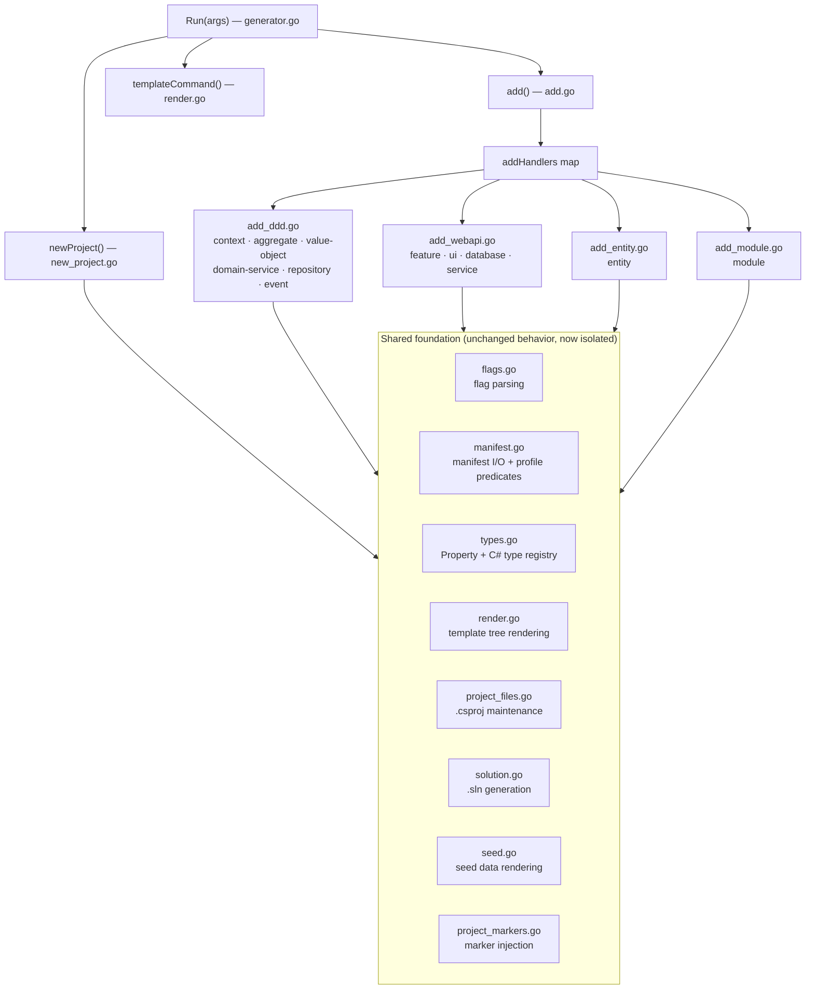
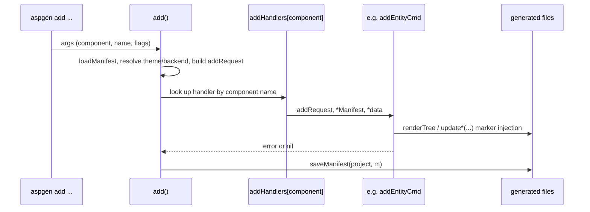
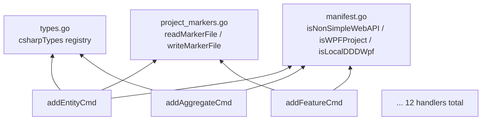

# aspgen Generator Refactor: Architecture & Extension Guide

**One package, ten cohesive files. Same behavior, much easier to extend.**

Version 1.0  |  `internal/generator`  |  04 August 2026

## 1. Why we refactored

Before this change, `internal/generator/generator.go` was a single **1,625-line**
file holding CLI parsing, manifest I/O, template rendering, `.csproj`/`.sln`
maintenance, marker-based code injection, and every `new`/`add` subcommand.
Four pain points motivated the split:

| Pain point | Symptom |
|---|---|
| One giant file | Any change required scrolling past unrelated concerns; diffs were noisy and hard to review. |
| Monolithic `add()` switch | ~320 lines of one function mixed manifest updates, validation, and rendering for 12 different subcommands. |
| Duplicated marker injection | Eight near-identical "read file → check idempotency → check marker → replace → write/dry-run" blocks, each with copy-pasted I/O boilerplate. |
| Scattered type mapping | `mapType`, `controlForType`, and `seedLiteral` each re-implemented their own switch over the same set of C# types, so adding a type meant editing three places. |

None of this was a correctness problem — the tests all passed — but it made the
codebase harder to extend safely. The refactor is **behavior-preserving**: it
is a pure internal reorganization with no change to generated output, CLI
flags, or manifest format. All 22 existing tests pass unmodified.

## 2. What changed, at a glance



`generator.go` itself is now ~25 lines: it only dispatches `new`, `add`,
`templates`, and `version` to the file that owns each concern.

### File map

| File | Owns |
|---|---|
| [generator.go](../internal/generator/generator.go) | `Run` entry point and top-level dispatch only |
| [new_project.go](../internal/generator/new_project.go) | The `new` subcommand |
| [add.go](../internal/generator/add.go) | `add` prologue (manifest load, theme/backend resolution) + `addHandlers` dispatch table |
| [add_ddd.go](../internal/generator/add_ddd.go) | `add context/aggregate/value-object/domain-service/repository/event` |
| [add_webapi.go](../internal/generator/add_webapi.go) | `add feature/ui/database/service` |
| [add_entity.go](../internal/generator/add_entity.go) | `add entity` (the most profile-sensitive handler) |
| [add_module.go](../internal/generator/add_module.go) | `add module` |
| [manifest.go](../internal/generator/manifest.go) | `Manifest`/`Context` types, load/save, component helpers, profile predicates |
| [types.go](../internal/generator/types.go) | `Property`, `parseProperties`, the C# type registry, identifier/name helpers |
| [flags.go](../internal/generator/flags.go) | Three-form flag parsing (`--flag value`, `--flag:value`, `-flag:value`) |
| [render.go](../internal/generator/render.go) | Template tree rendering, `templates` subcommand |
| [project_files.go](../internal/generator/project_files.go) | `.csproj` discovery, normalization, reference rewriting |
| [solution.go](../internal/generator/solution.go) | `.sln` writing |
| [seed.go](../internal/generator/seed.go) | Dummy-seed code block generation |
| [project_markers.go](../internal/generator/project_markers.go) | The 8 `// aspgen:*` marker-injection functions |

All of these files live in the **same package** (`package generator`) — this
was a deliberate, lower-risk choice over splitting into Go sub-packages, since
every function already shared the same manifest/data/template types and a
sub-package split would have forced a much larger, riskier API surface change.

## 3. Why it's better

- **Discoverability.** "Where does `add aggregate` validation happen?" now has
  a one-file answer ([add_ddd.go](../internal/generator/add_ddd.go)) instead of
  "somewhere in a 320-line switch."
- **Smaller diffs.** Adding a new `add` subcommand touches `add.go`'s handler
  map (one line) plus a new or existing `add_*.go` file — not a shared
  monolith that every other subcommand also lives in.
- **Safer type changes.** Adding a C# property type is one entry in the
  `csharpTypes` registry ([types.go](../internal/generator/types.go)) instead
  of three separate `switch` statements that can silently drift out of sync.
  See [§5.2](#52-adding-a-new-property-type).
- **Less copy-paste risk in marker injection.** The eight marker functions now
  share `readMarkerFile`/`writeMarkerFile`/`missingMarkerErr`
  ([project_markers.go](../internal/generator/project_markers.go)), so the
  read-error-wrap, dry-run-vs-write, and missing-marker-error shapes are
  defined once. Each function still owns its own idempotency check and marker
  string, because those genuinely differ per file (see the callout in
  [§5.3](#53-adding-a-new-marker-injected-file)).
- **Fewer repeated profile checks.** `isNonSimpleWebAPI`, `isWPFProject`, and
  `isLocalDDDWpf` in [manifest.go](../internal/generator/manifest.go) replace
  repeated `isWebAPI(*m) && !hasComponent(m.Components, "backend:simple")`-
  style chains that were previously copy-pasted across handlers.
- **Zero behavior change.** Every one of the 22 tests in
  [generator_test.go](../internal/generator/generator_test.go) and
  [layout_integration_test.go](../internal/generator/layout_integration_test.go)
  passes unmodified — including the integration tests that generate real file
  trees and diff their contents.

## 4. How the `add` dispatch works now



`addRequest` is the shared context every handler receives:

```go
type addRequest struct {
    Args    []string // flags following the component and name
    Name    string
    Project string
    DryRun  bool
    Force   bool
    Theme   string
    Backend string
}
```

`add.go` builds one `addRequest`, resolves the manifest and `data` context
exactly as before, then dispatches through:

```go
var addHandlers = map[string]func(addRequest, *Manifest, *data) error{
    "context":        addContextCmd,
    "aggregate":      addAggregateCmd,
    "entity":         addEntityCmd,
    "feature":        addFeatureCmd,
    // ...
}
```

Adding a new component is adding one map entry plus one handler function — see
[§5.1](#51-adding-a-new-add-subcommand).

## 5. Extending the codebase

### 5.1 Adding a new `add` subcommand

1. Pick the closest existing sibling file (`add_ddd.go` for DDD-flavored
   components, `add_webapi.go` for webapi-only components, or a new
   `add_<area>.go` file if the component doesn't fit either).
2. Write a handler with the shared signature:

   ```go
   func addWidgetCmd(r addRequest, m *Manifest, d *data) error {
       if !validIdentifier(r.Name) {
           return fmt.Errorf("invalid widget name %q", r.Name)
       }
       // validate the project profile, e.g.:
       if !isWebAPI(*m) {
           return errors.New("widget generation requires a webapi or fullstack project")
       }
       if err := renderTree(r.Project, "widget", *d, templateDir(r.Args), r.DryRun, r.Force); err != nil {
           return err
       }
       m.Components = appendUnique(m.Components, "widget:"+r.Name)
       return nil
   }
   ```

3. Register it in `addHandlers` in [add.go](../internal/generator/add.go):

   ```go
   "widget": addWidgetCmd,
   ```

4. Add the template tree under
   [internal/templates/files/](../internal/templates/files) if the handler
   renders new files.
5. Add a test in [generator_test.go](../internal/generator/generator_test.go)
   that runs `new` then `add widget ...` into a temp dir and asserts on the
   generated content, mirroring `TestWebAPIFeatureGeneration`.
6. Run the full verification checklist in [§6](#6-verification-checklist).

### 5.2 Adding a new property type

All property-type behavior is centralized in
[types.go](../internal/generator/types.go):

```go
var userTypeAliases = map[string]string{
    "string": "string", "int": "int", /* ... */
    "date": "DateOnly", "datetime": "DateTime", "guid": "Guid", "uuid": "Guid",
}

var csharpTypes = map[string]csharpTypeInfo{
    "string": {UIControl: "InputText", Seed: func(property string, row int) string { /* ... */ }},
    // ...
}
```

To add a type (say, `timespan` → `TimeSpan`):

1. Add the CLI alias to `userTypeAliases`: `"timespan": "TimeSpan"`.
2. Add the canonical type's behavior to `csharpTypes`, providing both the WPF
   `UIControl` name and a `Seed` function that produces a valid C# literal:

   ```go
   "TimeSpan": {UIControl: "InputText", Seed: func(_ string, row int) string {
       return fmt.Sprintf("TimeSpan.FromMinutes(%d)", 5+row)
   }},
   ```

3. That's it — `mapType`, `controlForType`, and `seedLiteral` all read from
   this one registry, so nullable handling, WPF control selection, and dummy
   seed generation all pick up the new type automatically.
4. Add a case to `TestParseProperties`/`TestDummySeedGeneration` covering the
   new type.

### 5.3 Adding a new marker-injected file

The eight functions in
[project_markers.go](../internal/generator/project_markers.go) each inject a
generated line into an existing file at a `// aspgen:*` marker comment. They
share three helpers:

```go
readMarkerFile(path, description string) (string, error)
writeMarkerFile(path, textContent string, dryRun bool) error
missingMarkerErr(fileDesc, marker string) error
```

A new marker function should follow the same shape:

```go
func updateWidgetHost(project, namespace, widget string, dryRun bool) error {
    path := filepath.Join(project, "src", "WebApi", "Program.cs")
    textContent, err := readMarkerFile(path, "widget host")
    if err != nil {
        return err
    }
    call := "app.MapWidget(" + widget + ");"
    if strings.Contains(textContent, call) { // idempotency: already applied
        return nil
    }
    if !strings.Contains(textContent, "// aspgen:widgets") {
        return missingMarkerErr("Program.cs", "// aspgen:widgets")
    }
    textContent = strings.Replace(textContent, "// aspgen:widgets", "// aspgen:widgets\n"+call, 1)
    return writeMarkerFile(path, textContent, dryRun)
}
```

> **Note:** each function's idempotency check (the "already applied" test) and
> its exact marker string are intentionally *not* unified further. They differ
> per file by design — some markers require a specific indentation and some
> idempotency checks look for a rendered line rather than the marker itself —
> and forcing them into one shape risks changing which files can be
> incrementally regenerated. Keep each function's own check inline; only reuse
> the three helpers above.

## 6. Verification checklist

Run after any change under `internal/generator`:

```powershell
gofmt -l internal/generator          # must print nothing
go build ./cmd/... ./internal/...
go vet ./cmd/... ./internal/...
go test ./cmd/... ./internal/... -v
```

`./...` is not used because `agent/skills/**/assets` and `.claude/skills/**`
contain standalone example `.go` files that don't compile on their own.

Pay special attention to the integration tests that exercise the full
generated file tree end to end:

- `TestNewAndIncrementalGeneration` — idempotent incremental `add` runs.
- `TestDddAggregateGeneration` / `TestDddBackendEntityGeneration` — DDD backend routing.
- `TestWebAPIFeatureGeneration` — feature host marker injection.
- `TestGeneratedLayoutIntegration` — full layout across all four sub-profiles.
- `TestDummySeedGeneration` — seed literal generation per type.

## 7. Where the shared foundation sits



Every handler sits on top of the same three consolidation points. When in
doubt about where a new piece of shared logic belongs, it belongs in one of
these three files, not in a handler.

---

Prepared 04 August 2026 for the `refactor` branch of `aspgen`.
